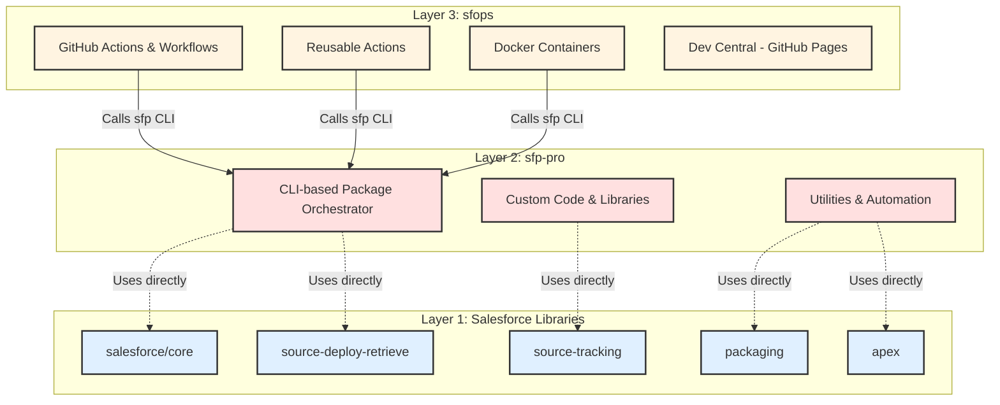
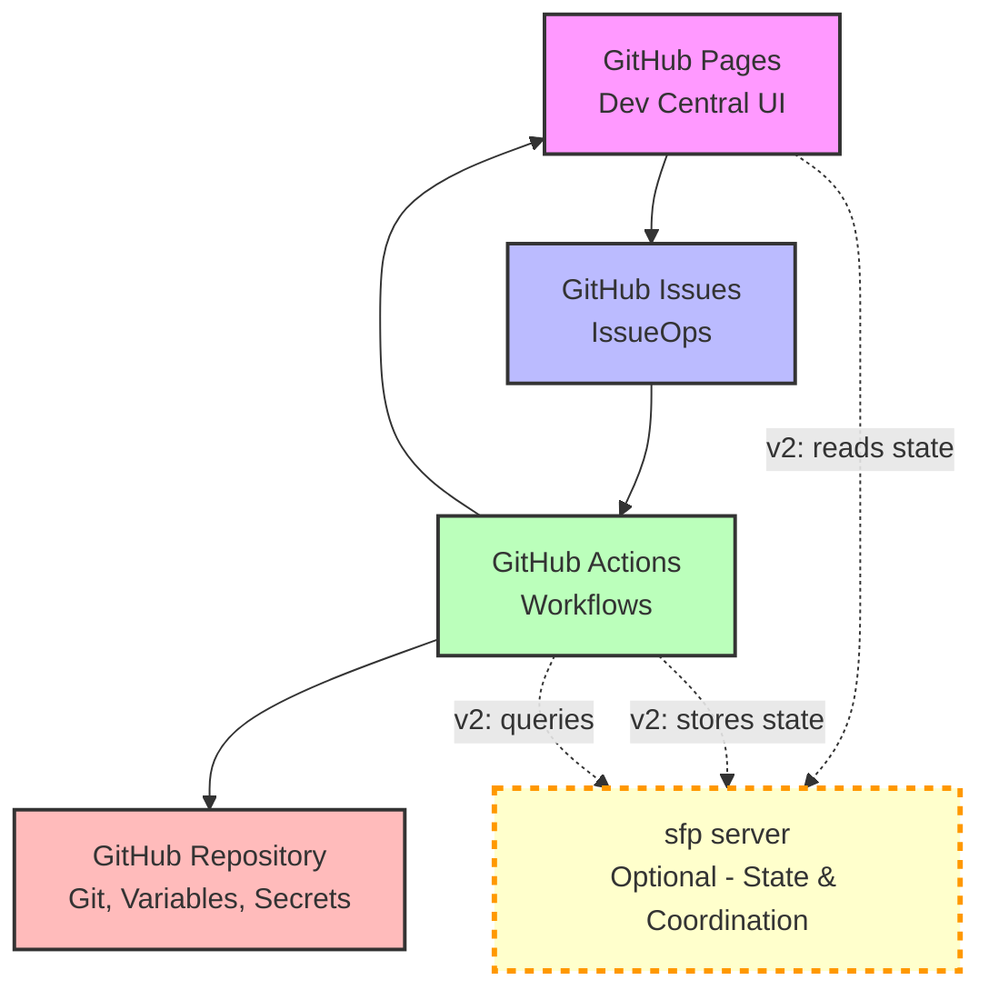
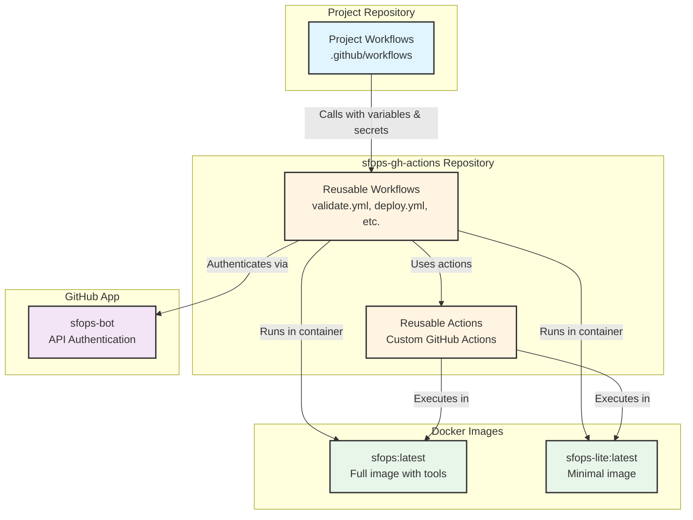
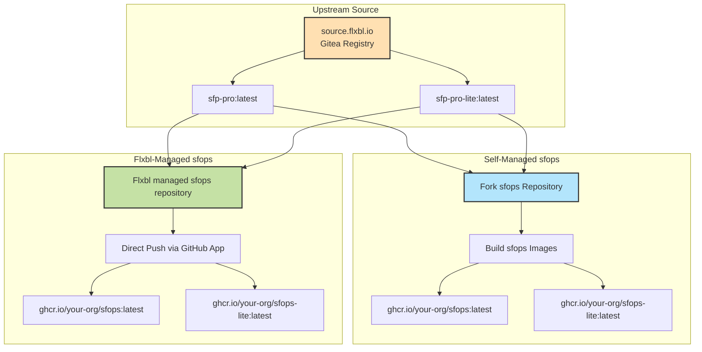
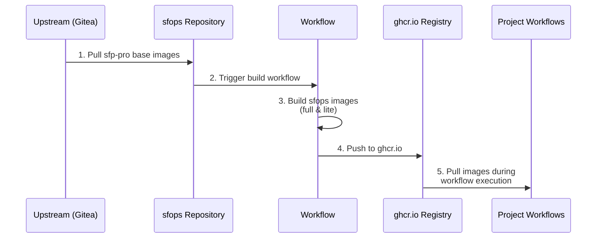
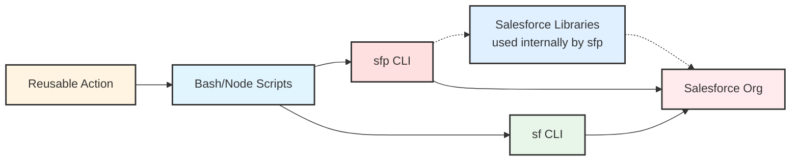
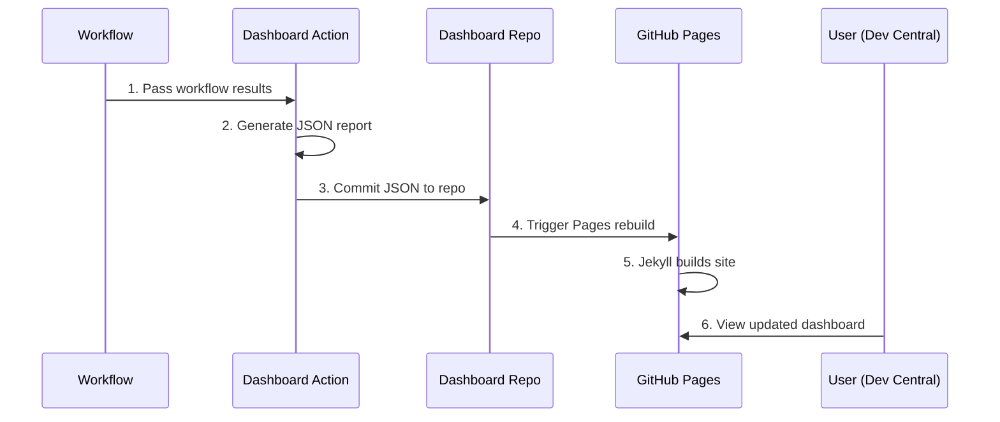
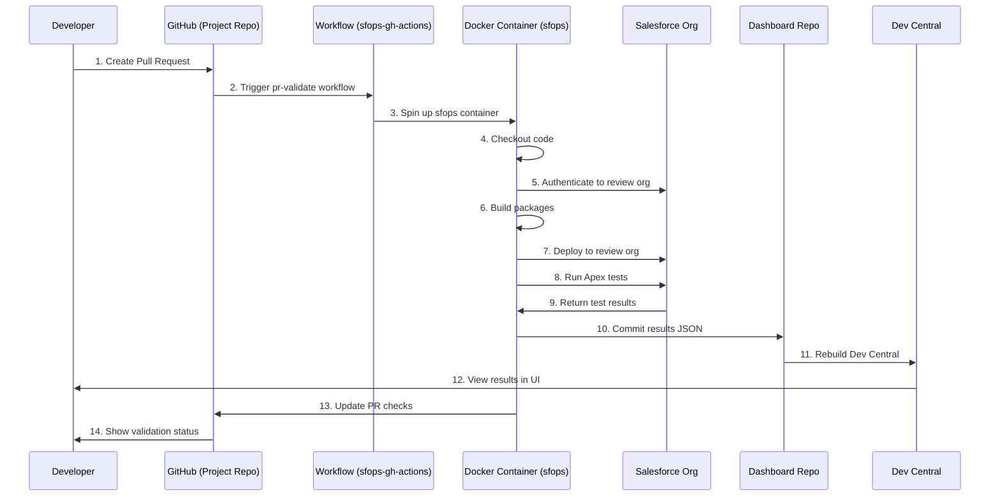
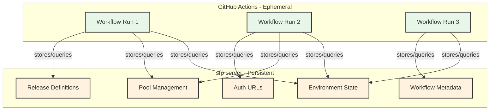

# Architecture

This page provides a comprehensive overview of sfops' technical architecture, explaining how the various components work together to deliver GitHub-native Salesforce DevOps.

## The sfops Stack

sfops is built on a layered architecture, with each layer providing specific capabilities:



### Layer 1: Salesforce Libraries (Foundation - Used Internally)

The foundation layer consists of official Salesforce libraries running on Node.js runtime. **This layer is never executed directly by sfops** - it is used internally by sfp-pro:

* **@salesforce/core**: Core Salesforce authentication and org management
* **@salesforce/source-deploy-retrieve**: Metadata deployment and retrieval
* **@salesforce/source-tracking**: Source change tracking
* **@salesforce/packaging**: Package creation and management
* **@salesforce/apex**: Apex test execution and code analysis

**Important**: sfops does not call these libraries directly. They are dependencies of sfp-pro. sfp-pro uses these libraries programmatically, not through the Salesforce CLI executable.

### Layer 2: sfp-pro (Orchestration Engine)

The middle layer provides package lifecycle orchestration and is what sfops actually executes:

* **CLI-based orchestrator**: Exposes commands that sfops workflows call (e.g., `sfp pool:fetch`, `sfp orchestrator:deploy`)
* **Direct library usage**: Uses @salesforce libraries programmatically in its implementation
* **Custom code and libraries**: Additional functionality beyond standard Salesforce libraries
* **Bundled utilities**: Pre-configured tools for common DevOps tasks

**Execution model**: sfops scripts execute `sfp` CLI commands, which internally use Salesforce libraries directly (not via `sf` CLI).

### Layer 3: sfops (GitHub Automation)

The outer layer delivers GitHub-native automation by calling sfp-pro:

* **GitHub Actions**: Workflows and actions that execute `sfp` CLI commands (and `sf` CLI when needed) via NodeJS and Bash scripts
* **Reusable Components**: Workflows and actions consumed from sfops-gh-actions repository
* **Docker Containers**: GitHub Actions run in Docker containers (sfops:latest or sfops-lite:latest)
* **Dev Central**: Jekyll-based web application hosted on GitHub Pages

**Execution model**: All sfops automation runs within GitHub Actions. sfops primarily calls `sfp` CLI for orchestration, but can also use `sf` CLI directly when needed for specific Salesforce operations.

## sfops Interaction Model

sfops uses GitHub's native platform capabilities to create a seamless developer experience:



### Component Interaction Flow

1. **GitHub Pages (Dev Central)**
   * Static web application providing visibility into ALM processes
   * Displays dashboards, metrics, releases, and work items
   * Links to GitHub Issues for operational requests
   * **v2**: Reads environment state and metadata from sfp server
2. **GitHub Issues/Forms (IssueOps)**
   * Users create issues for operational requests (deployments, environments, permissions)
   * Issue templates with structured forms
   * Comments and PR interactions trigger workflows
3. **GitHub Actions (Execution Engine)**
   * Workflows composed using Docker images from ghcr.io
   * Executes automation in response to events
   * Updates state and generates reports
   * **v2**: Stores environment state, release definitions, and workflow metadata in sfp server
   * **v2**: Queries sfp server for environment assignments and pool state
4. **GitHub Repository & Packages**
   * Git repositories for source control
   * Variables and secrets for configuration
   * Environments for deployment targets
   * Container registry (ghcr.io) for Docker images
5. **sfp server (Optional - v2 Feature)**
   * **Persistent state management**: Stores environment metadata, assignments, and pool state across workflow runs
   * **Distributed coordination**: Enables safe concurrent access to shared environments across parallel workflows
   * **Cross-workflow context**: Shares state and metadata across multiple workflows and repositories
   * **Centralized authentication**: Manages credentials and auth URLs without exposing them to workflow logs
   * **Release tracking**: Stores release definitions and deployment history for complete auditability

## sfops Execution Layer

The execution layer orchestrates how workflows are deployed and executed across your GitHub organization:



### Execution Components

#### 1. Docker Images

sfops utilizes two Docker images served from your organization's GitHub Container Registry (ghcr.io):

* **sfops:latest** - Full image containing:
  * sfp-pro binaries (includes Salesforce libraries)
  * Salesforce CLI (`sf`)
  * PMD for code analysis
  * Browserforce for configuration
  * Java runtime
* **sfops-lite:latest** - Minimal image containing:
  * sfp-pro binaries (includes Salesforce libraries)
  * Used for lightweight operations where full tooling is not needed

#### 2. Reusable Workflows & Actions

Workflows and actions are centralized in the `sfops-gh-actions` repository within your GitHub organization:

* Reusable workflows for common patterns (validation, deployment, releases)
* Custom actions for specific operations
* Consumed by project repositories via workflow calls

#### 3. GitHub App Integration

GitHub-related API calls are executed through a custom GitHub App (`sfops-bot`) provisioned in your organization:

* Cross-repository operations
* Issue and PR automation
* Workflow triggers
* **Exception**: Package publishing uses personal access tokens (PAT)

#### 4. Project Workflows

Project-specific workflows reside in each Salesforce project repository:

* React to repository events (push, PR, issues)
* Call reusable workflows from sfops-gh-actions
* Pass configuration via variables and secrets
* Customizable for project-specific needs

## Runtime Images & Distribution

sfops builds upon sfp-pro Docker images, distributed differently based on your deployment model:



### sfp-pro Docker Images

sfp-pro CLI is distributed as two Docker image variants, which sfops extends:

| Image            | Contents                                                                                         | Use Case                                     |
| ---------------- | ------------------------------------------------------------------------------------------------ | -------------------------------------------- |
| **sfp-pro**      | sfp-pro binaries (includes Salesforce libraries), Salesforce CLI (`sf`), PMD, Browserforce, Java | Full-featured operations requiring all tools |
| **sfp-pro-lite** | sfp-pro binaries only (includes Salesforce libraries)                                            | Lightweight operations, faster startup       |

**Note**: sfops images are built on top of these sfp-pro base images, adding sfops-specific scripts and configurations.

### Distribution Models

#### Self-Managed Instances

Organizations maintaining their own sfops installation:

1. Access sfp-pro base images from source.flxbl.io (Gitea registry)
2. Fork sfops repository to GitHub organization
3. Build sfops and sfops-lite images using base images
4. Publish to organization's GitHub Container Registry (ghcr.io)
5. Workflows reference these custom images
6. Synchronize updates from upstream sfops repository

#### Flxbl-Managed Instances

Organizations with Flxbl team managing sfops:

1. Flxbl team has direct access to your organization via GitHub App
2. Docker images pushed directly to your organization's GitHub Container Registry (ghcr.io)
3. Workflows and actions pushed directly to your sfops-gh-actions repository
4. Automatic updates when new versions are released
5. Your organization maintains stable, production-ready code

### Image Publishing Flow

For self-managed instances, the image build and distribution process:



## Workflow Execution Flow

Understanding how workflows execute from trigger to completion:

### Step 1: Event Triggers Workflow

Project workflows react to events in the repository:

```yaml
# Example: Pull Request Workflow
on:
  pull_request:
    types: [opened, synchronize, reopened]
    branches:
      - main
      - release-*
```

**Supported Events:**

* `pull_request` - PR opened, synchronized, or reopened
* `push` - Code pushed to branch
* `issues` - Issue created or commented
* `workflow_dispatch` - Manual trigger
* `schedule` - Cron-based scheduling

### Step 2: Call Reusable Workflow

Project workflow calls reusable workflow from sfops-gh-actions:

```yaml
jobs:
  validate-changes:
    name: 'Validate changes raised in a PR'
    uses: flxbl-io/sfops-gh-actions/.github/workflows/pr-validate.yml@main
    with:
      sfopsbot-app-id: ${{ vars.SFOPSBOT_APP_ID }}
      metrics-provider: ${{ vars.SFOPS_METRICS_PROVIDER }}
      devhub-username: ${{ vars.DEVHUB_USERNAME }}
    secrets:
      DEVHUB_SFDX_AUTH_URL: ${{ secrets.DEVHUB_SFDX_AUTH_URL }}
      SB_SFDX_AUTH_URL: ${{ secrets.SB_SFDX_AUTH_URL }}
      DATADOG_API_KEY: ${{ secrets.DATADOG_API_KEY }}
      SFOPSBOT_APP_PRIVATE_KEY: ${{ secrets.SFOPSBOT_APP_PRIVATE_KEY }}
      NPM_TOKEN: ${{ secrets.GITHUB_TOKEN }}
```

**Data Passed:**

* **Variables (`with`)**: Non-sensitive configuration
* **Secrets (`secrets`)**: Sensitive credentials and tokens
* **Context**: GitHub event context automatically available

### Step 3: Workflow Expands and Executes

The reusable workflow defines jobs that execute in sequence or parallel. Here's a real example from sfops:

```yaml
# Real example from build-publish-domain.yml reusable workflow
jobs:
  fetch-snapshot-envs:
    name: Fetch Snapshot Environments
    runs-on: ubuntu-latest
    outputs:
      envsAsJSON: ${{ steps.fetchSnapshotEnvs.outputs.allEnvsAsJSON }}
    steps:
      - uses: actions/checkout@v4
        with:
          fetch-depth: 0

      - uses: actions/create-github-app-token@v1
        id: app-token
        name: "Get installation token for sfopsbot"
        with:
          app-id: ${{ inputs.sfopsbot-app-id }}
          private-key: ${{ secrets.SFOPSBOT_APP_PRIVATE_KEY }}
          owner: ${{ github.repository_owner }}

      - uses: ${{ sfops.repo_owner }}/${{ sfops.action_repository }}/fetchAllEnvs@main
        id: fetchSnapshotEnvs
        with:
          gh_token: ${{ steps.app-token.outputs.token }}
          filter: "type:snapshot,branch:${{ inputs.branchname }}"

  build:
    name: "Build packages"
    runs-on: ubuntu-latest
    container: ${{ sfops.sfops_docker_image }}  # Uses sfops:latest Docker image
    steps:
      - uses: actions/checkout@v4
        with:
          fetch-depth: 0

      - uses: actions/create-github-app-token@v1
        id: app-token
        name: "Get installation token for sfopsbot"
        with:
          app-id: ${{ inputs.sfopsbot-app-id }}
          private-key: ${{ secrets.SFOPSBOT_APP_PRIVATE_KEY }}
          owner: ${{ github.repository_owner }}

      - name: "Authenticate Dev Hub"
        run: |
          echo "${{ secrets.DEVHUB_SFDX_AUTH_URL }}" > ./authfile
          sfp org login -f authfile -a devhub

      - name: "Create packages"
        id: sfp-build
        run: |
          sfp build -v devhub --diffcheck --branch ${{ inputs.branchname }} \
            --buildnumber ${GITHUB_RUN_ID} --releaseconfig=${{ inputs.releaseconfig }}

      - name: "Report Package Info"
        uses: ${{ sfops.repo_owner }}/${{ sfops.action_repository }}/packageInfoReporter@main
        with:
          pathToReleaseConfigs: ${{ inputs.pathToReleaseConfigs }}
          dashboard-repo: ${{ inputs.dashboard-repo }}
          gh_token: ${{ steps.app-token.outputs.token }}
          branch: ${{ inputs.branchname }}
```

**Job Execution:**

* Jobs run in Docker containers using `${{ sfops.sfops_docker_image }}` (sfops:latest) or `${{ sfops.sfops_lite_docker_image }}` (sfops-lite:latest)
* Each step executes sequentially within a job
* Jobs can run in parallel unless dependencies specified (e.g., `build` waits for `fetch-snapshot-envs` if needed)
* Container images are pulled from your organization's GitHub Container Registry (ghcr.io)

### Step 4: Actions Execute Core Logic

Reusable actions encapsulate scripts and CLI operations:



**Action Components:**

* **Wrapper scripts**: NodeJS or Bash scripts that orchestrate operations
* **CLI commands**: Primarily calls to `sfp` CLI for orchestration, with `sf` CLI used when needed for specific Salesforce operations
* **Custom logic**: Project-specific automation and transformations
* **Error handling**: Validation, retries, and failure reporting

**Key distinction**:

* **sfops (GitHub Actions)**: Can call both `sfp` CLI and `sf` CLI
* **sfp-pro**: Uses Salesforce libraries programmatically - does not use `sf` CLI executable

### Step 5: Report Results to Dashboard

Workflows generate JSON reports and commit to sfops-dashboard repository:

```yaml
- name: Report Branch Status
  uses: flxbl-io/sfops-gh-actions/branchDeploymentReporter@main
  with:
    status: 'validation'
    branch: ${{ github.event.pull_request.head.ref }}
    dashboard-repo: ${{ vars.SFOPS_DASHBOARD_REPO }}
    gh_token: ${{ steps.app-token.outputs.token }}
    issue-number: ${{ github.event.pull_request.number }}
```

**Dashboard Update Flow:**



**Report Data:**

* Build status and metrics
* Package deployment results
* Test execution summaries
* Environment state changes
* Pull request impacts

The dashboard (Dev Central) automatically rebuilds when new JSON files are committed, providing real-time visibility into all operations.

## Complete End-to-End Flow

Putting it all together, here's how a pull request validation flows through the system:



## sfp server Integration (Optional)

sfp server is an optional stateful layer that enhances sfops with persistent state management and advanced coordination capabilities. It is available in v2 workflows and recommended for enterprise deployments.

### What sfp server Provides



### Key Capabilities

#### 1. Environment Management

* Stores environment metadata, assignments, and configuration
* Tracks which PR is assigned to which review environment
* Maintains pool state for scratch orgs and sandboxes
* Manages environment lifecycles and expiration

#### 2. Authentication Management

* Centralized storage of auth URLs
* No need for environment-specific secrets in GitHub
* Dynamic credential retrieval during workflow execution
* Support for any environment naming convention

#### 3. Release Tracking

* Stores release definitions and configurations
* Tracks deployment history across environments
* Provides complete audit trail for compliance
* Enables release rollback and comparison

#### 4. Distributed Coordination

* Distributed locks for concurrent workflow execution
* Safe access to shared environments across parallel workflows
* Prevents race conditions in environment allocation
* Coordinates pool operations across multiple workflows

#### 5. Cross-Workflow State

* Shares context between different workflows
* Maintains state across workflow runs
* Enables workflows to query previous run results
* Supports multi-repository coordination

### How Components Interact with sfp server

**sfp CLI:**

* Executes commands with `--sfpserverurl` and `--sfpservertoken` parameters
* Stores environment state after operations (fetch, deploy, release)
* Queries server for available environments and pool status
* Updates release definitions and deployment status

**GitHub Actions Workflows:**

* Pass `SFP_SERVER_URL` and `SFP_SERVER_TOKEN` to reusable workflows
* Use v2/v3 workflows that include server integration
* Automatically sync state after major operations
* Query server for environment assignments

**Dev Central:**

* Reads environment state from sfp server REST API
* Displays real-time pool status and environment assignments
* Shows release history and deployment tracking
* No longer relies solely on JSON files in dashboard repository

### Migration Path

**v1 (Current)**: GitHub-only, state stored in JSON files in dashboard repository

**v2 (Optional)**: Hybrid mode - can use sfp server for state while maintaining v1 compatibility

**v3 (Future)**: Full sfp server integration with enhanced features

Organizations can adopt sfp server gradually:

1. Start with v1 workflows (no server required)
2. Provision sfp server and enable v2 workflows for specific features
3. Migrate fully to v3 workflows when ready

See the [changelog](changelog/august25.md) for details on v2/v3 workflow features.

## Key Architecture Benefits

### 1. GitHub-Native

Everything runs on GitHub's infrastructure - no external platforms, no separate UIs to manage.

### 2. Transparent & Debuggable

* All workflows visible in `.github/workflows`
* All actions visible in sfops-gh-actions repository
* Full execution logs in GitHub Actions
* No hidden logic or black-box operations

### 3. Stateful & Scalable

**Without sfp server (v1)**:

* State stored in JSON files in dashboard repository
* Works well for most teams
* Simple setup with no additional infrastructure

**With sfp server (v2+)**:

* Persistent environment state across workflow runs
* Distributed coordination for concurrent operations
* Centralized authentication and credential management
* Enhanced release tracking and audit capabilities

### 4. Concurrent & Safe

* Parallel environment deployments
* Concurrent workflow execution
* Pool-based environment management
* Distributed lock coordination (with sfp server)

### 5. Extensible

* Add custom workflows to project repositories
* Create custom actions in sfops-gh-actions
* Extend Dev Central with custom dashboards
* Integrate with external tools via workflows
* Optional sfp server for advanced state management

## Next Steps

Now that you understand the architecture, explore:

* [Environments](environments/) - How environments are managed and configured
* [Project Workflows](project-workflows/) - Detailed workflow documentation
* [Self-Managed Setup](self-managed-instances/setting-up/) - Deploy your own sfops instance
* [IssueOps](issueops/access/) - Operational automation via GitHub Issues
