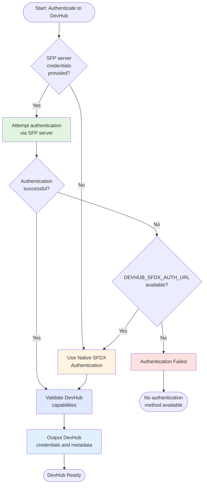

---
keywords:
  - custom workflows
  - devhub authentication
  - authToDevHubHybrid
  - sfp server
  - custom actions
  - workflow authentication
  - devhub access
  - scratch org creation
  - package development
description: >-
  Learn how to use hybrid DevHub authentication in custom workflows to
  seamlessly authenticate to Salesforce DevHub with automatic fallback support
  between SFP server and native authentication
---

# Hybrid DevHub Authentication

The `authToDevHubHybrid` action provides flexible DevHub authentication for custom workflows. It automatically attempts to authenticate via SFP server first, then falls back to native SFDX authentication if needed. This ensures your workflows can authenticate to DevHub regardless of whether it's managed by SFP server or configured with native credentials.

## Overview

DevHub authentication is essential for many Salesforce development operations like creating scratch orgs, managing packages, and running CI/CD pipelines. The hybrid DevHub authentication action provides:

* **Automatic authentication method selection** between SFP server and native SFDX
* **Seamless fallback mechanism** if SFP server authentication fails
* **Zero configuration changes** when switching between authentication methods
* **Consistent outputs** regardless of the authentication method used
* **DevHub validation** to ensure the authenticated org is a valid DevHub

This makes it perfect for:

* Scratch org creation workflows
* Package development and versioning
* Unlocked package operations
* 2GP (Second Generation Package) workflows
* Custom CI/CD pipelines
* Development environment provisioning

## How It Works

The action follows an intelligent authentication flow:



## Prerequisites

Before using this action in your custom workflow, ensure:

1.  **Your workflow uses the sfops Docker image** - Required for SFP CLI and dependencies:

    ```yaml
    jobs:
      your-job:
        runs-on: ubuntu-latest
        container: ${{ sfops.sfops_docker_image }}
    ```
2. **At least one authentication method is configured**:
   * **For SFP server**: `SFP_SERVER_URL` (variable) and `SFP_SERVER_TOKEN` (secret)
   * **For native auth**: `DEVHUB_SFDX_AUTH_URL` (secret)
   * **For maximum flexibility**: Configure both methods
3. **DevHub is properly configured** - The target org must have DevHub features enabled

## Referencing the Action

The `authToDevHubHybrid` action is located in your sfops repository. In all examples below, the action is referenced using:

```yaml
uses: ${{ sfops.repo_owner }}/${{ sfops.action_repository }}/authToDevHubHybrid@main
```

The `${{ sfops.repo_owner }}/${{ sfops.action_repository }}` template variables are automatically replaced with your organization and sfops repository name (e.g., `flxbl-io/sfops-gh-actions`).

## Basic Usage

### Simple DevHub Authentication

Minimal configuration that works with either authentication method:

```yaml
name: Create Scratch Org
on:
  workflow_dispatch:
    inputs:
      duration:
        description: 'Scratch org duration (days)'
        required: true
        default: '7'

jobs:
  create-scratch-org:
    runs-on: ubuntu-latest
    container: ${{ sfops.sfops_docker_image }}
    steps:
      - name: Checkout
        uses: actions/checkout@v4

      - name: Authenticate to DevHub
        id: devhub
        uses: ${{ sfops.repo_owner }}/${{ sfops.action_repository }}/authToDevHubHybrid@main
        with:
          repository: ${{ github.repository }}
          sfp-server-url: ${{ vars.SFP_SERVER_URL }}
          sfp-server-token: ${{ secrets.SFP_SERVER_TOKEN }}
          DEVHUB_SFDX_AUTH_URL: ${{ secrets.DEVHUB_SFDX_AUTH_URL }}

      - name: Create Scratch Org
        run: |
          sfdx force:org:create \
            --targetdevhubusername ${{ steps.devhub.outputs.alias }} \
            --definitionfile config/project-scratch-def.json \
            --durationdays ${{ inputs.duration }} \
            --setalias my-scratch-org \
            --json
```

### With Custom Alias

Specify a custom alias for the DevHub:

```yaml
- name: Authenticate to DevHub
  id: devhub
  uses: ${{ sfops.repo_owner }}/${{ sfops.action_repository }}/authToDevHubHybrid@main
  with:
    repository: ${{ github.repository }}
    alias: my-devhub  # Custom alias instead of default "devhub"
    sfp-server-url: ${{ vars.SFP_SERVER_URL }}
    sfp-server-token: ${{ secrets.SFP_SERVER_TOKEN }}
    DEVHUB_SFDX_AUTH_URL: ${{ secrets.DEVHUB_SFDX_AUTH_URL }}
```

### SFP Server Only Configuration

When you only use SFP server for DevHub management:

```yaml
- name: Authenticate to DevHub (SFP Server)
  id: devhub
  uses: ${{ sfops.repo_owner }}/${{ sfops.action_repository }}/authToDevHubHybrid@main
  with:
    repository: ${{ github.repository }}
    sfp-server-url: ${{ vars.SFP_SERVER_URL }}
    sfp-server-token: ${{ secrets.SFP_SERVER_TOKEN }}
    # No DEVHUB_SFDX_AUTH_URL - will fail if SFP auth fails
```

### Native Only Configuration

When you only use native SFDX authentication:

```yaml
- name: Authenticate to DevHub (Native)
  id: devhub
  uses: ${{ sfops.repo_owner }}/${{ sfops.action_repository }}/authToDevHubHybrid@main
  with:
    repository: ${{ github.repository }}
    DEVHUB_SFDX_AUTH_URL: ${{ secrets.DEVHUB_SFDX_AUTH_URL }}
    # No SFP server credentials - will use native auth directly
```


## Input Reference

| Input                  | Required | Default  | Description                               |
| ---------------------- | -------- | -------- | ----------------------------------------- |
| `repository`           | Yes      | -        | Repository name in `owner/repo` format    |
| `sfp-server-url`       | No       | -        | URL to your SFP server instance           |
| `sfp-server-token`     | No       | -        | Authentication token for SFP server       |
| `DEVHUB_SFDX_AUTH_URL` | No       | -        | Auth URL for native DevHub authentication |
| `alias`                | No       | `devhub` | Alias to use for the authenticated DevHub |
| `wait`                 | No       | `false`  | Enable wait flag for authentication       |

## Output Reference

| Output         | Description                                               | Example Usage                              |
| -------------- | --------------------------------------------------------- | ------------------------------------------ |
| `alias`        | Alias of the authenticated DevHub                         | `${{ steps.devhub.outputs.alias }}`        |
| `org_id`       | Salesforce Org ID of the DevHub                           | `${{ steps.devhub.outputs.org_id }}`       |
| `api_version`  | API version of the DevHub                                 | `${{ steps.devhub.outputs.api_version }}`  |
| `instance_url` | Instance URL of the DevHub                                | `${{ steps.devhub.outputs.instance_url }}` |
| `login_url`    | Login URL of the DevHub                                   | `${{ steps.devhub.outputs.login_url }}`    |
| `access_token` | Access token for API calls                                | `${{ steps.devhub.outputs.access_token }}` |
| `username`     | Username of authenticated DevHub user                     | `${{ steps.devhub.outputs.username }}`     |
| `auth_method`  | Method used for authentication (`sfp-server` or `native`) | `${{ steps.devhub.outputs.auth_method }}`  |
| `is_devhub`    | Always `true` for successful authentication               | `${{ steps.devhub.outputs.is_devhub }}`    |


## Common Use Cases

### Continuous Integration

Authenticate to DevHub for running tests in scratch orgs during CI/CD.

### Package Development

Create and manage package versions using DevHub capabilities.

### Environment Provisioning

Automate creation of development and testing environments.

### Dependency Management

Install and manage package dependencies from DevHub.

### Org Limits Monitoring

Check DevHub limits and scratch org allocation.

## Troubleshooting

### Authentication Failures

If authentication fails with both methods:

1. Verify SFP server credentials are correct
2. Check DevHub is registered in SFP server (if using SFP)
3. Validate `DEVHUB_SFDX_AUTH_URL` is properly formatted
4. Ensure the target org has DevHub features enabled


### Fallback Not Working

Ensure both credentials are provided:

```yaml
with:
  sfp-server-url: ${{ vars.SFP_SERVER_URL }}
  sfp-server-token: ${{ secrets.SFP_SERVER_TOKEN }}
  DEVHUB_SFDX_AUTH_URL: ${{ secrets.DEVHUB_SFDX_AUTH_URL }}  # Must be present for fallback
```

##
