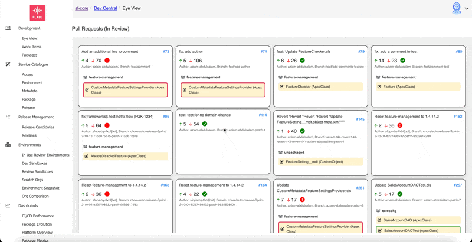

# November24

sfops November 24 (v30.5.0)  brings the following updates

### sfops

#### Update sfdx-scanner to v4.7.0

sfdx-scanner used in the sfops image is now updated to v4.7.0 , This means existing PMD configurations in your project repository (pmd-rulesets) now have to be updated


Flxbl Managed instances will have a pull request open with the necessary PMD configuration, Self Managed users can utilize the latest rules in your sfops repository here/\
[https://source.flxbl.io/flxbl/sfops/src/branch/main/pmd-rulesets](https://source.flxbl.io/flxbl/sfops/src/branch/main/pmd-rulesets)


#### Update to GitHub related actions

Few GitHub actions which have been deprecated have been updated to the latest versions,&#x20;

### DevCentral

#### GitHub Integration&#x20;

sfops dev central, now features a GitHub integration executed via  Flxbl's Global Supabase instance.  All Flxbl Managed instances will utilize this instance to handle authentication. This Global Supabase instance is more of an Auth provider and orchestrates OAuth-based authentication in DevCentral

This is controlled via \_config.yml in your **devcentral** (sfops-dashboard0 repository  under the following section

```
# Global Flxbl Configuration
# If you are self hosting, change it with supabase api and anon key
supabase:
  url: https://zllcmuwkimjcgoazlhyn.supabase.co
  anon_key: <anon-key>
```


For self-hosted users, or managed instance users who do not wish to use the authentication, please feel free to comment on this section in your  config (\_config.yaml file in devcentral repo)


Utilizing this configuration,  dev central will be able to offer tighter integrations with Github. These integrations will be rolled out progressively over the coming releases


Please note your GitHub Admin has to authorize Flxbl's GItHub Connector App for authnetication to work

<figure><figcaption><p>Authenticate Flxbl Github Connector App in your org</p></figcaption></figure>

#### Create Issues directly from DevCentral

Enabling GitHub integration with DevCentral will unlock the ability to create issues directly without opening up a new tab&#x20;

<figure><figcaption></figcaption></figure>

#### Duplicate Release Issue Detection

Utilizing the GitHub Integration, **sfops** will now be able to detect if an existing issue is opened for a particular release prompting your team members with an alert

<figure><figcaption></figcaption></figure>

