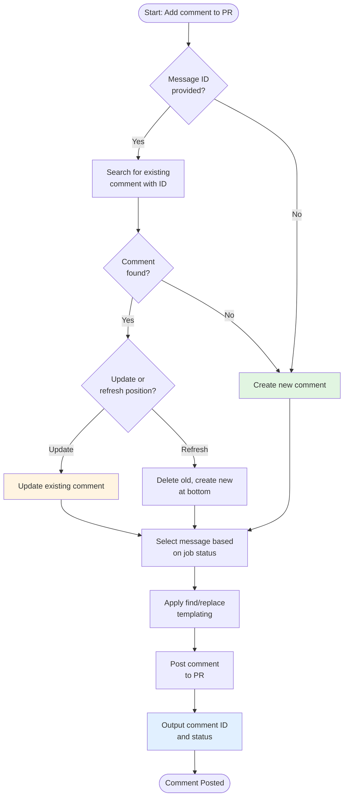

# Add PR Comment

The `add-pr-comment` action provides robust PR comment management for custom workflows. It supports creating, updating, and deduplicating comments with status-based messaging, making it ideal for providing workflow feedback directly in pull requests.

## Overview

Providing clear feedback on pull requests is essential for developer experience. The add PR comment action provides:

* **Comment deduplication** using message IDs to update existing comments instead of creating duplicates
* **Status-based messaging** with different messages for success, failure, cancelled, or skipped states
* **Message templating** with find/replace support for dynamic content
* **File-based messages** for complex or multi-line content
* **Position refresh** to move updated comments to the bottom of the conversation

This makes it perfect for:

* Deployment status notifications
* Validation result summaries
* Build artifact links
* Test coverage reports
* Any workflow feedback that belongs on the PR

## How It Works

The action follows this workflow:



## Prerequisites

Before using this action in your custom workflow:

1. **GitHub token with PR write access** - You have several options:

   * **Default token**: Use `${{ github.token }}` (limited permissions, may not work for forked PRs)
   * **GitHub App token**: Use `actions/create-github-app-token` with `pull_requests: write` permission
   * **sfp server token**: Use [Get GitHub Token](get-github-token.md) action if using sfp server

2. **PR context** - The action needs to know which PR to comment on, typically from the event context

## Referencing the Action

The `add-pr-comment` action is located in your sfops repository. In all examples below, the action is referenced using:

```yaml
uses: ${{ sfops.repo_owner }}/${{ sfops.action_repository }}/add-pr-comment@main
```

## Basic Usage

### Simple Comment

Add a basic comment to the current PR:

```yaml
name: PR Feedback
on:
  pull_request:
    types: [opened, synchronize]

jobs:
  notify:
    runs-on: ubuntu-latest
    steps:
      - name: Add Comment
        uses: ${{ sfops.repo_owner }}/${{ sfops.action_repository }}/add-pr-comment@main
        with:
          message: |
            ## Build Started
            Your changes are being validated. Results will be posted here.
          message-id: build-status
```

### Status-Based Messages

Provide different messages based on job outcome:

```yaml
jobs:
  build:
    runs-on: ubuntu-latest
    steps:
      - name: Run Build
        run: npm run build

      - name: Post Build Status
        if: always()
        uses: ${{ sfops.repo_owner }}/${{ sfops.action_repository }}/add-pr-comment@main
        with:
          message-id: build-result
          message-success: |
            ## Build Successful
            All checks passed. Ready for review.
          message-failure: |
            ## Build Failed
            Please check the workflow logs for details.
          message-cancelled: |
            ## Build Cancelled
            The build was cancelled before completion.
```

### Update Existing Comment

Update a previous comment instead of creating a new one:

```yaml
- name: Update Deployment Status
  uses: ${{ sfops.repo_owner }}/${{ sfops.action_repository }}/add-pr-comment@main
  with:
    message-id: deployment-status
    message: |
      ## Deployment Complete
      - Environment: ${{ matrix.environment }}
      - Status: Deployed
      - Time: ${{ steps.deploy.outputs.timestamp }}
```

### Refresh Comment Position

Move an updated comment to the bottom of the conversation:

```yaml
- name: Post Final Status
  uses: ${{ sfops.repo_owner }}/${{ sfops.action_repository }}/add-pr-comment@main
  with:
    message-id: final-status
    refresh-message-position: "true"
    message: |
      ## All Validations Complete
      Your PR is ready for final review.
```

## Input Reference

### Core Inputs

| Input       | Required | Default          | Description                                |
| ----------- | -------- | ---------------- | ------------------------------------------ |
| `message`   | No*      | -                | The message content to post                |
| `message-path` | No*   | -                | Path to file(s) containing the message     |
| `message-id`| Yes      | `add-pr-comment` | Unique ID for comment deduplication        |
| `repo-token`| No       | `github.token`   | GitHub token for API access                |

*Either `message` or `message-path` should be provided.

### Status-Based Messages

| Input              | Required | Description                              |
| ------------------ | -------- | ---------------------------------------- |
| `status`           | No       | Job status (defaults to `job.status`)    |
| `message-success`  | No       | Message when status is success           |
| `message-failure`  | No       | Message when status is failure           |
| `message-cancelled`| No       | Message when status is cancelled         |
| `message-skipped`  | No       | Message when status is skipped           |

### Behavior Options

| Input                    | Required | Default | Description                                    |
| ------------------------ | -------- | ------- | ---------------------------------------------- |
| `allow-repeats`          | No       | `false` | Allow duplicate messages with same ID          |
| `refresh-message-position`| No      | `false` | Move updated comment to bottom of conversation |
| `update-only`            | No       | `false` | Only update if comment exists, don't create    |
| `preformatted`           | No       | `false` | Wrap message in code block                     |

### Templating Options

| Input     | Required | Description                                        |
| --------- | -------- | -------------------------------------------------- |
| `find`    | No       | Regex pattern(s) to find (one per line)            |
| `replace` | No       | Replacement text(s) for find patterns              |

### Repository Context

| Input       | Required | Default                     | Description          |
| ----------- | -------- | --------------------------- | -------------------- |
| `repo-owner`| No       | `github.repository_owner`   | Repository owner     |
| `repo-name` | No       | `github.event.repository.name` | Repository name   |
| `issue`     | No       | PR number from context      | Issue/PR number      |

## Output Reference

| Output           | Description                              |
| ---------------- | ---------------------------------------- |
| `comment-created`| Whether a new comment was created        |
| `comment-updated`| Whether an existing comment was updated  |
| `comment-id`     | The ID of the created/updated comment    |

## Common Use Cases

### Deployment Status Tracker

Track deployment progress across multiple environments:

```yaml
jobs:
  deploy:
    runs-on: ubuntu-latest
    strategy:
      matrix:
        environment: [qa, staging, prod]
    steps:
      - name: Deploy
        id: deploy
        run: |
          # Deployment logic
          echo "status=success" >> $GITHUB_OUTPUT

      - name: Update PR with Status
        uses: ${{ sfops.repo_owner }}/${{ sfops.action_repository }}/add-pr-comment@main
        with:
          message-id: deploy-${{ matrix.environment }}
          message: |
            ## ${{ matrix.environment }} Deployment
            | Status | Environment | Time |
            |--------|-------------|------|
            | ${{ steps.deploy.outputs.status == 'success' && ':white_check_mark:' || ':x:' }} | ${{ matrix.environment }} | ${{ github.event.head_commit.timestamp }} |
```

### Validation Summary with File Content

Post validation results from a file:

```yaml
- name: Run Validation
  run: |
    sfp validate --json > validation-results.json
    # Generate markdown summary
    node scripts/format-results.js > validation-summary.md

- name: Post Validation Results
  uses: ${{ sfops.repo_owner }}/${{ sfops.action_repository }}/add-pr-comment@main
  with:
    message-id: validation-results
    message-path: validation-summary.md
    refresh-message-position: "true"
```

### Dynamic Content with Templating

Use find/replace for dynamic content:

```yaml
- name: Post Coverage Report
  uses: ${{ sfops.repo_owner }}/${{ sfops.action_repository }}/add-pr-comment@main
  with:
    message-id: coverage
    message: |
      ## Code Coverage Report
      - Coverage: {{COVERAGE}}%
      - Lines: {{LINES_COVERED}}/{{TOTAL_LINES}}
    find: |
      {{COVERAGE}}
      {{LINES_COVERED}}
      {{TOTAL_LINES}}
    replace: |
      ${{ steps.coverage.outputs.percentage }}
      ${{ steps.coverage.outputs.covered }}
      ${{ steps.coverage.outputs.total }}
```

### Conditional Comment Updates

Only update comment if it exists:

```yaml
- name: Update If Exists
  uses: ${{ sfops.repo_owner }}/${{ sfops.action_repository }}/add-pr-comment@main
  with:
    message-id: optional-update
    update-only: "true"
    message: |
      ## Updated Status
      Additional information added.
```

## Best Practices

### Use Meaningful Message IDs

Choose descriptive, unique message IDs to prevent conflicts:

```yaml
# Good - descriptive and scoped
message-id: validation-apex-tests
message-id: deploy-staging-status
message-id: coverage-report-main

# Avoid - too generic
message-id: status
message-id: comment
```

### Leverage Status-Based Messages

Provide context-appropriate feedback:

```yaml
with:
  message-id: build-status
  message-success: |
    ## :white_check_mark: Build Passed
    All checks completed successfully.
  message-failure: |
    ## :x: Build Failed
    Please review the errors below and push a fix.

    [View Logs](${{ github.server_url }}/${{ github.repository }}/actions/runs/${{ github.run_id }})
```

### Keep Comments Focused

Avoid overwhelming PRs with too many comments. Consolidate related information:

```yaml
# Instead of multiple comments, use one with sections
message: |
  ## Validation Results

  ### Build Status
  ${{ steps.build.outputs.summary }}

  ### Test Results
  ${{ steps.test.outputs.summary }}

  ### Coverage
  ${{ steps.coverage.outputs.summary }}
```

## Troubleshooting

### Comment Not Updating

If comments are being created instead of updated:

1. Verify the `message-id` matches exactly
2. Check that `allow-repeats` is `false`
3. Ensure the token has permission to read existing comments

### Permission Errors

If you receive 403 errors:

1. Verify the token has `pull_requests: write` permission
2. For forked PRs, use a GitHub App token instead of `GITHUB_TOKEN`
3. Check repository settings for workflow permissions
