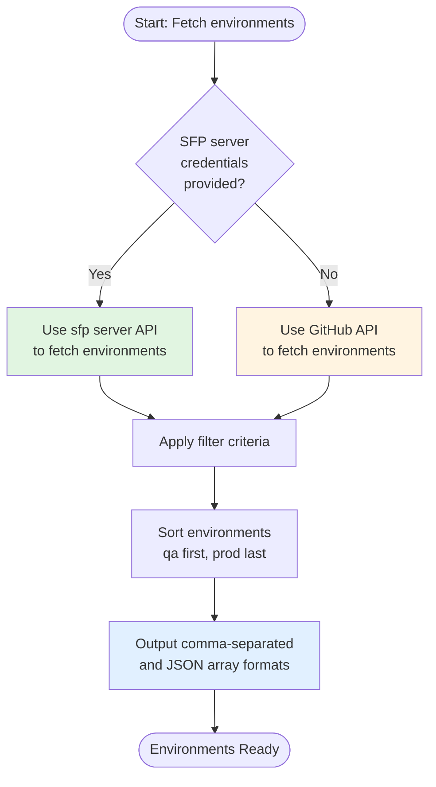

# Fetch All Environments

The `fetchAllEnvs` action provides dynamic environment discovery for custom workflows. It fetches environments from GitHub Environments or sfp server with intelligent hybrid detection, enabling powerful matrix builds and multi-environment operations.

## Overview

When building workflows that need to operate across multiple Salesforce environments, hardcoding environment names creates maintenance overhead and limits flexibility. The fetch all environments action provides:

* **Hybrid mode detection** automatically using GitHub Environments or sfp server
* **Flexible filtering** by environment type, branch, or metadata attributes
* **Matrix build support** with JSON array output for GitHub Actions matrix strategy
* **Environment sorting** with qa first and production last for safe deployment ordering
* **Dashboard integration** writing environment info for sfops dashboard sync

This makes it perfect for:

* Dynamic deployment pipelines across multiple environments
* Scheduled operations (tests, health checks) on filtered environment sets
* Release workflows targeting specific environment types
* Custom automation that adapts to infrastructure changes

## How It Works

The action follows an intelligent detection flow:



## Prerequisites

Before using this action in your custom workflow, ensure:

1.  **Your workflow has access to GitHub token** - Required for GitHub Environments mode. You can obtain a token using either method:

    **Option A: GitHub App Token** (standard approach)
    ```yaml
    - uses: actions/create-github-app-token@v1
      id: app-token
      with:
        app-id: ${{ vars.SFOPSBOT_APP_ID }}
        private-key: ${{ secrets.SFOPSBOT_APP_PRIVATE_KEY }}
    ```

    **Option B: sfp server Token** (if using sfp server) - See [Get GitHub Token](get-github-token.md)
    ```yaml
    - uses: ${{ sfops.repo_owner }}/${{ sfops.action_repository }}/get-github-token@main
      id: app-token
      with:
        sfp-server-url: ${{ vars.SFP_SERVER_URL }}
        sfp-server-token: ${{ secrets.SFP_SERVER_TOKEN }}
    ```

2. **For sfp server mode** (optional):
   * `SFP_SERVER_URL` as a variable or environment variable
   * `SFP_SERVER_TOKEN` as a secret or environment variable

## Referencing the Action

The `fetchAllEnvs` action is located in your sfops repository. In all examples below, the action is referenced using:

```yaml
uses: ${{ sfops.repo_owner }}/${{ sfops.action_repository }}/fetchAllEnvs@main
```

The `${{ sfops.repo_owner }}/${{ sfops.action_repository }}` template variables are automatically replaced with your organization and sfops repository name (e.g., `flxbl-io/sfops-gh-actions`).

## Basic Usage

### Fetch All Release Environments

Fetch all environments configured for releases:

```yaml
name: Deploy to All Release Environments
on:
  workflow_dispatch:

jobs:
  fetch-environments:
    runs-on: ubuntu-latest
    outputs:
      environments: ${{ steps.fetch.outputs.allEnvsAsJSON }}
      count: ${{ steps.fetch.outputs.count }}
    steps:
      - uses: actions/create-github-app-token@v1
        id: app-token
        with:
          app-id: ${{ vars.SFOPSBOT_APP_ID }}
          private-key: ${{ secrets.SFOPSBOT_APP_PRIVATE_KEY }}

      - name: Fetch Release Environments
        id: fetch
        uses: ${{ sfops.repo_owner }}/${{ sfops.action_repository }}/fetchAllEnvs@main
        with:
          gh_token: ${{ steps.app-token.outputs.token }}
          filter: "type:release"

      - name: Display Results
        run: |
          echo "Found ${{ steps.fetch.outputs.count }} environments"
          echo "Environments: ${{ steps.fetch.outputs.allEnvs }}"
          echo "Source: ${{ steps.fetch.outputs.source }}"

  deploy:
    needs: fetch-environments
    if: needs.fetch-environments.outputs.count > 0
    runs-on: ubuntu-latest
    strategy:
      matrix:
        environment: ${{ fromJSON(needs.fetch-environments.outputs.environments) }}
    steps:
      - run: echo "Deploying to ${{ matrix.environment }}"
```

### Filter by Branch

Fetch environments associated with a specific branch:

```yaml
- name: Fetch Main Branch Environments
  id: fetch
  uses: ${{ sfops.repo_owner }}/${{ sfops.action_repository }}/fetchAllEnvs@main
  with:
    gh_token: ${{ steps.app-token.outputs.token }}
    filter: "type:release,branch:main"
```

### Using sfp Server Mode

When using sfp server for environment management:

```yaml
- name: Fetch Environments from sfp Server
  id: fetch
  uses: ${{ sfops.repo_owner }}/${{ sfops.action_repository }}/fetchAllEnvs@main
  with:
    gh_token: ${{ steps.app-token.outputs.token }}
    filter: "type:release,metadata:testrun=true"
  env:
    SFP_SERVER_URL: ${{ vars.SFP_SERVER_URL }}
    SFP_SERVER_TOKEN: ${{ secrets.SFP_SERVER_TOKEN }}
```

## Input Reference

| Input              | Required | Default              | Description                                           |
| ------------------ | -------- | -------------------- | ----------------------------------------------------- |
| `gh_token`         | Yes      | -                    | GitHub token for API access                           |
| `filter`           | No       | `''`                 | Filter string for environment selection (see below)   |
| `repository`       | No       | `$GITHUB_REPOSITORY` | Repository identifier in `owner/repo` format          |
| `sfp-server-url`   | No       | -                    | URL to sfp server (can also use env var)              |
| `sfp-server-token` | No       | -                    | Token for sfp server auth (can also use env var)      |

### Filter Syntax

The filter syntax differs slightly between GitHub mode and sfp server mode:

**GitHub Environments Mode:**

| Filter | Description | Example |
|--------|-------------|---------|
| `type:{value}` | Filter by TYPE environment variable | `type:release` |
| `branch:{value}` | Filter by BRANCH environment variable | `branch:main` |
| Combined | Multiple filters (AND logic) | `type:snapshot,branch:feature` |

**sfp Server Mode:**

| Filter | Description | Example |
|--------|-------------|---------|
| `type:{value}` | Filter by category field | `type:release` |
| `branch:{value}` | Filter by branch field | `branch:main` |
| `metadata:{key}={value}` | Filter by metadata attributes | `metadata:testrun=true` |
| Combined | Multiple filters | `type:test,metadata:testrun=true` |

## Output Reference

| Output         | Description                                    | Example                      |
| -------------- | ---------------------------------------------- | ---------------------------- |
| `allEnvs`      | Comma-separated list of environment names      | `qa,staging,prod`            |
| `allEnvsAsJSON`| JSON array for matrix builds                   | `["qa","staging","prod"]`    |
| `source`       | Source used for fetching                       | `github` or `sfp-server`     |
| `count`        | Number of environments found                   | `3`                          |

## Common Use Cases

### Matrix Deployment Pipeline

Deploy to all release environments in sequence:

```yaml
jobs:
  fetch-envs:
    runs-on: ubuntu-latest
    outputs:
      environments: ${{ steps.fetch.outputs.allEnvsAsJSON }}
    steps:
      - uses: actions/create-github-app-token@v1
        id: app-token
        with:
          app-id: ${{ vars.SFOPSBOT_APP_ID }}
          private-key: ${{ secrets.SFOPSBOT_APP_PRIVATE_KEY }}

      - uses: ${{ sfops.repo_owner }}/${{ sfops.action_repository }}/fetchAllEnvs@main
        id: fetch
        with:
          gh_token: ${{ steps.app-token.outputs.token }}
          filter: "type:release"

  deploy:
    needs: fetch-envs
    runs-on: ubuntu-latest
    container: ${{ sfops.sfops_docker_image }}
    strategy:
      fail-fast: false
      max-parallel: 1  # Deploy sequentially
      matrix:
        environment: ${{ fromJSON(needs.fetch-envs.outputs.environments) }}
    steps:
      - uses: actions/checkout@v4

      - name: Authenticate and Deploy
        run: |
          echo "Deploying to ${{ matrix.environment }}"
          # Your deployment logic here
```

### Scheduled Health Checks

Run health checks across all test environments:

```yaml
name: Environment Health Check
on:
  schedule:
    - cron: '0 */6 * * *'  # Every 6 hours

jobs:
  fetch-test-envs:
    runs-on: ubuntu-latest
    outputs:
      environments: ${{ steps.fetch.outputs.allEnvsAsJSON }}
    steps:
      - uses: actions/create-github-app-token@v1
        id: app-token
        with:
          app-id: ${{ vars.SFOPSBOT_APP_ID }}
          private-key: ${{ secrets.SFOPSBOT_APP_PRIVATE_KEY }}

      - uses: ${{ sfops.repo_owner }}/${{ sfops.action_repository }}/fetchAllEnvs@main
        id: fetch
        with:
          gh_token: ${{ steps.app-token.outputs.token }}
          filter: "type:test"
        env:
          SFP_SERVER_URL: ${{ vars.SFP_SERVER_URL }}
          SFP_SERVER_TOKEN: ${{ secrets.SFP_SERVER_TOKEN }}

  health-check:
    needs: fetch-test-envs
    runs-on: ubuntu-latest
    container: ${{ sfops.sfops_docker_image }}
    strategy:
      matrix:
        environment: ${{ fromJSON(needs.fetch-test-envs.outputs.environments) }}
    steps:
      - name: Check Environment Health
        run: |
          echo "Checking health of ${{ matrix.environment }}"
          # Your health check logic here
```

### Conditional Workflow Based on Environment Count

Skip deployment if no environments match:

```yaml
jobs:
  fetch-envs:
    runs-on: ubuntu-latest
    outputs:
      environments: ${{ steps.fetch.outputs.allEnvsAsJSON }}
      has-envs: ${{ steps.fetch.outputs.count > 0 }}
    steps:
      - uses: ${{ sfops.repo_owner }}/${{ sfops.action_repository }}/fetchAllEnvs@main
        id: fetch
        with:
          gh_token: ${{ secrets.GITHUB_TOKEN }}
          filter: "type:release,branch:${{ github.ref_name }}"

  deploy:
    needs: fetch-envs
    if: needs.fetch-envs.outputs.has-envs == 'true'
    runs-on: ubuntu-latest
    steps:
      - run: echo "Proceeding with deployment"
```

## Environment Sorting

The action automatically sorts environments in a deployment-safe order:

1. **qa** environments appear first (if present)
2. **All other environments** in alphabetical order
3. **prod/production** environments appear last (if present)

This ensures that in matrix builds, lower environments are processed before production.

## Troubleshooting

### No Environments Found

If the action returns zero environments:

1. Verify the filter syntax matches your environment configuration
2. Check that environments have the required variables (TYPE, BRANCH for GitHub mode)
3. Ensure sfp server credentials are correct (for sfp server mode)
4. Verify the repository parameter is correct

### Mode Detection Issues

The action uses sfp server mode when both `SFP_SERVER_URL` and `SFP_SERVER_TOKEN` are available (via inputs or environment variables). To force GitHub mode, ensure these are not set.

### Matrix Build Failures

If matrix builds fail with JSON parsing errors:

1. Check that `allEnvsAsJSON` is properly quoted in `fromJSON()`
2. Verify the fetch job completed successfully
3. Ensure the output is not empty (check `count` output)
