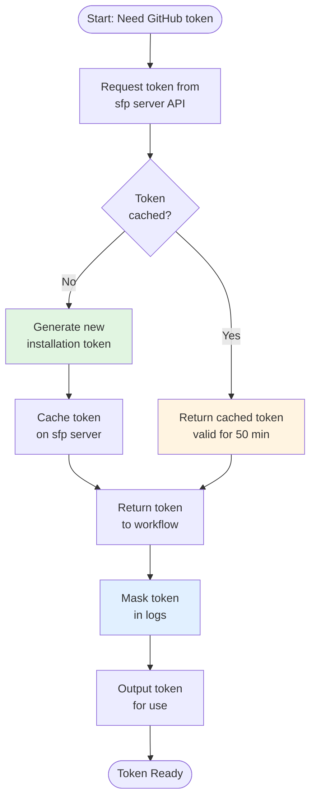

# Get GitHub Token

The `get-github-token` action fetches a GitHub authentication token from sfp server for repository operations. This provides a centralized way to obtain GitHub tokens without configuring GitHub Apps in each workflow, making it ideal for cross-repository operations and simplified authentication.

## Overview

Many custom workflows need GitHub tokens for operations like cloning repositories, creating PRs, or posting comments. The get GitHub token action provides:

* **Centralized token management** through sfp server
* **No GitHub App configuration** required in workflows
* **Automatic token caching** (50 minutes) to reduce API calls
* **Automatic retries** with built-in retry logic for reliability
* **Secure token handling** with automatic masking in logs
* **Fast execution** without requiring Docker images

This makes it perfect for:

* Cross-repository operations (accessing other repos)
* Workflows that don't have GitHub App credentials
* Centralized authentication management
* Simplified workflow setup

## How It Works

The action retrieves tokens from sfp server's authentication API:



## Prerequisites

Before using this action:

1. **sfp server is configured** with GitHub integration:
   * `SFP_SERVER_URL` as a variable
   * `SFP_SERVER_TOKEN` as a secret

2. **Repository is registered** in sfp server as a project

3. **No Docker image required** - This action runs natively on Node.js

## Referencing the Action

The `get-github-token` action is located in your sfops repository:

```yaml
uses: ${{ sfops.repo_owner }}/${{ sfops.action_repository }}/get-github-token@main
```

## Basic Usage

### Simple Token Retrieval

Get a token for the current repository:

```yaml
name: Custom Workflow
on:
  workflow_dispatch:

jobs:
  use-token:
    runs-on: ubuntu-latest
    steps:
      - name: Get GitHub Token
        id: get-token
        uses: ${{ sfops.repo_owner }}/${{ sfops.action_repository }}/get-github-token@main
        with:
          sfp-server-url: ${{ vars.SFP_SERVER_URL }}
          sfp-server-token: ${{ secrets.SFP_SERVER_TOKEN }}

      - name: Use Token for Git Operations
        run: |
          git clone https://x-access-token:${{ steps.get-token.outputs.token }}@github.com/${{ github.repository }}.git
```

### Cross-Repository Access

Get a token for a different repository:

```yaml
- name: Get Token for Dashboard Repo
  id: dashboard-token
  uses: ${{ sfops.repo_owner }}/${{ sfops.action_repository }}/get-github-token@main
  with:
    sfp-server-url: ${{ vars.SFP_SERVER_URL }}
    sfp-server-token: ${{ secrets.SFP_SERVER_TOKEN }}
    repository: my-org/sfops-dashboard

- name: Clone Dashboard Repository
  run: |
    git clone https://x-access-token:${{ steps.dashboard-token.outputs.token }}@github.com/my-org/sfops-dashboard.git
```

### Use with Other Actions

Combine with other sfops actions that need GitHub tokens:

```yaml
jobs:
  fetch-and-deploy:
    runs-on: ubuntu-latest
    steps:
      - name: Get GitHub Token
        id: gh-token
        uses: ${{ sfops.repo_owner }}/${{ sfops.action_repository }}/get-github-token@main
        with:
          sfp-server-url: ${{ vars.SFP_SERVER_URL }}
          sfp-server-token: ${{ secrets.SFP_SERVER_TOKEN }}

      - name: Fetch All Environments
        id: fetch-envs
        uses: ${{ sfops.repo_owner }}/${{ sfops.action_repository }}/fetchAllEnvs@main
        with:
          gh_token: ${{ steps.gh-token.outputs.token }}
          filter: "type:release"
```

## Input Reference

| Input              | Required | Default                | Description                              |
| ------------------ | -------- | ---------------------- | ---------------------------------------- |
| `sfp-server-url`   | Yes      | -                      | URL to sfp server instance               |
| `sfp-server-token` | Yes      | -                      | sfp server authentication token          |
| `repository`       | No       | `${{ github.repository }}` | Repository in `owner/repo` format    |

## Output Reference

| Output  | Description                                    |
| ------- | ---------------------------------------------- |
| `token` | GitHub installation token (masked in logs)     |

## Comparison: get-github-token vs GitHub App Token

sfops provides two ways to obtain GitHub tokens. Choose based on your needs:

### get-github-token (sfp server)

```yaml
- name: Get Token via sfp server
  id: token
  uses: ${{ sfops.repo_owner }}/${{ sfops.action_repository }}/get-github-token@main
  with:
    sfp-server-url: ${{ vars.SFP_SERVER_URL }}
    sfp-server-token: ${{ secrets.SFP_SERVER_TOKEN }}
```

**Best for:**
- Workflows using sfp server
- Cross-repository operations
- Centralized token management
- Simplified setup (no App ID/private key needed)

### actions/create-github-app-token

```yaml
- uses: actions/create-github-app-token@v1
  id: app-token
  with:
    app-id: ${{ vars.SFOPSBOT_APP_ID }}
    private-key: ${{ secrets.SFOPSBOT_APP_PRIVATE_KEY }}
```

**Best for:**
- Direct GitHub App authentication
- Workflows not using sfp server
- Fine-grained permission control
- Standard sfops workflows

## Common Use Cases

### Dashboard Updates

Update the sfops dashboard repository:

```yaml
- name: Get Token
  id: token
  uses: ${{ sfops.repo_owner }}/${{ sfops.action_repository }}/get-github-token@main
  with:
    sfp-server-url: ${{ vars.SFP_SERVER_URL }}
    sfp-server-token: ${{ secrets.SFP_SERVER_TOKEN }}
    repository: ${{ vars.DASHBOARD_REPO }}

- name: Update Dashboard
  uses: ${{ sfops.repo_owner }}/${{ sfops.action_repository }}/updateGitRepo@main
  with:
    gh_token: ${{ steps.token.outputs.token }}
    target-repo: ${{ vars.DASHBOARD_REPO }}
    # ... other inputs
```

### PR Comments

Post comments on pull requests:

```yaml
- name: Get Token
  id: token
  uses: ${{ sfops.repo_owner }}/${{ sfops.action_repository }}/get-github-token@main
  with:
    sfp-server-url: ${{ vars.SFP_SERVER_URL }}
    sfp-server-token: ${{ secrets.SFP_SERVER_TOKEN }}

- name: Add PR Comment
  uses: ${{ sfops.repo_owner }}/${{ sfops.action_repository }}/add-pr-comment@main
  with:
    repo-token: ${{ steps.token.outputs.token }}
    message: "Deployment complete!"
    message-id: deployment-status
```

### Multi-Repository Operations

Operate across multiple repositories:

```yaml
jobs:
  sync-repos:
    runs-on: ubuntu-latest
    strategy:
      matrix:
        repo: [repo-a, repo-b, repo-c]
    steps:
      - name: Get Token for ${{ matrix.repo }}
        id: token
        uses: ${{ sfops.repo_owner }}/${{ sfops.action_repository }}/get-github-token@main
        with:
          sfp-server-url: ${{ vars.SFP_SERVER_URL }}
          sfp-server-token: ${{ secrets.SFP_SERVER_TOKEN }}
          repository: my-org/${{ matrix.repo }}

      - name: Clone and Process
        run: |
          git clone https://x-access-token:${{ steps.token.outputs.token }}@github.com/my-org/${{ matrix.repo }}.git
          cd ${{ matrix.repo }}
          # Process repository
```

## Token Details

### Token Characteristics

- **Type**: GitHub App installation token
- **Scope**: Repository-scoped (limited to specified repository)
- **Expiration**: Valid for ~1 hour (generated fresh or from 50-min cache)
- **Permissions**: Inherited from sfp server's GitHub App configuration

### Security

The action automatically:
- Masks the token in all GitHub Actions logs
- Uses HTTPS for all API communications
- Never logs the full token value

## Retry Behavior

The action includes built-in retry logic:

- **Max retries**: 3 attempts
- **Delay between retries**: 5 seconds
- **Retryable errors**: Network failures, temporary server errors

## Troubleshooting

### Repository Not Found (404)

If you receive a 404 error:

1. Verify the repository is registered as a project in sfp server
2. Check the repository name format (`owner/repo`)
3. Ensure the sfp server has access to the repository

### Authentication Failed (403)

If you receive a 403 error:

1. Verify `SFP_SERVER_TOKEN` is correct and not expired
2. Check the token has appropriate permissions in sfp server
3. Ensure the sfp server's GitHub App has access to the repository

### Token Not Working

If the token doesn't work for your operation:

1. Verify the sfp server's GitHub App has required permissions
2. Check if the operation requires additional scopes
3. Try regenerating the token (cache may have stale permissions)
