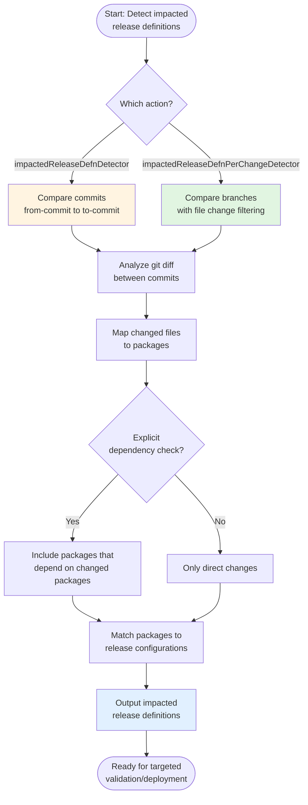

# Impacted Release Definition Detector

sfops provides two actions for detecting impacted release definitions based on code changes. These enable intelligent workflows that only validate or deploy affected domains, significantly improving CI/CD efficiency in multi-domain Salesforce projects.

## Overview

In large Salesforce projects with multiple domains or packages, validating and deploying everything on every change is wasteful. The impacted release definition detectors provide:

* **Change-based detection** analyzing git diffs to identify affected packages
* **Dependency awareness** including packages that depend on changed code
* **Release config integration** working with your existing release definition structure
* **Flexible comparison** between commits or branches

This makes them perfect for:

* Targeted PR validation (only validate changed domains)
* Efficient deployment pipelines (skip unchanged packages)
* Cost optimization (reduce scratch org and sandbox usage)
* Faster feedback loops in large monorepos

## Available Actions

sfops provides two variants with different detection strategies:

| Action | Strategy | Best For |
|--------|----------|----------|
| `impactedReleaseDefnDetector` | Commit-based comparison | Comparing specific commits (e.g., tag to tag) |
| `impactedReleaseDefnPerChangeDetector` | Branch-based comparison | PR validation (feature branch vs main) |

## How It Works

Both actions use the `sfp impact releaseconfig` command but with different parameters:



## Prerequisites

Before using these actions:

1. **Your workflow uses the sfops Docker image** - Required for sfp CLI:

    ```yaml
    jobs:
      detect-impact:
        runs-on: ubuntu-latest
        container: ${{ sfops.sfops_docker_image }}
    ```

2. **Release definitions exist** - Your repository must have release definition files in the expected location (typically `releaseconfigs/` or a custom path)

3. **Git history available** - The workflow needs access to git history for diff analysis:

    ```yaml
    - uses: actions/checkout@v4
      with:
        fetch-depth: 0  # Full history required
    ```

## Referencing the Actions

Both actions are located in your sfops repository:

```yaml
# Commit-based detection
uses: ${{ sfops.repo_owner }}/${{ sfops.action_repository }}/impactedReleaseDefnDetector@main

# Branch-based detection (recommended for PRs)
uses: ${{ sfops.repo_owner }}/${{ sfops.action_repository }}/impactedReleaseDefnPerChangeDetector@main
```

## Action 1: impactedReleaseDefnDetector

### Description

Detects impacted release definitions by comparing two specific commits. Useful for release pipelines or comparing tagged versions.

### Usage

```yaml
name: Detect Impact Between Commits
on:
  workflow_dispatch:
    inputs:
      from-commit:
        description: 'Starting commit (e.g., previous release tag)'
        required: true
      to-commit:
        description: 'Ending commit (e.g., HEAD)'
        required: true

jobs:
  detect:
    runs-on: ubuntu-latest
    container: ${{ sfops.sfops_docker_image }}
    steps:
      - uses: actions/checkout@v4
        with:
          fetch-depth: 0

      - name: Detect Impacted Release Definitions
        id: impact
        uses: ${{ sfops.repo_owner }}/${{ sfops.action_repository }}/impactedReleaseDefnDetector@main
        with:
          pathToReleaseDefns: releaseconfigs
          from-commit: ${{ inputs.from-commit }}
          to-commit: ${{ inputs.to-commit }}
```

### Input Reference

| Input               | Required | Description                                       |
| ------------------- | -------- | ------------------------------------------------- |
| `pathToReleaseDefns`| Yes      | Path to directory containing release definitions  |
| `from-commit`       | Yes      | Starting commit SHA or reference                  |
| `to-commit`         | Yes      | Ending commit SHA or reference                    |
| `filterby`          | No       | Only return if specific release defn is impacted  |

## Action 2: impactedReleaseDefnPerChangeDetector

### Description

Detects impacted release definitions by comparing a feature branch against a base branch, with explicit dependency checking. This is the recommended action for PR validation workflows.

### Usage

```yaml
name: PR Validation with Impact Detection
on:
  pull_request:
    branches: [main]

jobs:
  detect-and-validate:
    runs-on: ubuntu-latest
    container: ${{ sfops.sfops_docker_image }}
    steps:
      - uses: actions/checkout@v4
        with:
          fetch-depth: 0

      - name: Detect Impacted Release Definitions
        id: impact
        uses: ${{ sfops.repo_owner }}/${{ sfops.action_repository }}/impactedReleaseDefnPerChangeDetector@main
        with:
          pathToReleaseDefns: releaseconfigs
          base-branch: ${{ github.base_ref }}
          feature-branch: ${{ github.head_ref }}
```

### Input Reference

| Input               | Required | Description                                       |
| ------------------- | -------- | ------------------------------------------------- |
| `pathToReleaseDefns`| Yes      | Path to directory containing release definitions  |
| `base-branch`       | Yes      | Base branch to compare against (e.g., main)       |
| `feature-branch`    | Yes      | Feature branch with changes                       |

### Key Features

The `impactedReleaseDefnPerChangeDetector` includes these additional capabilities via the underlying sfp command:

* **`--filterByChangesInBranch`**: Only considers files actually modified in the branch
* **`--explicitDependencyCheck`**: Includes packages that depend on changed packages

## Common Use Cases

### Targeted PR Validation

Only validate release definitions affected by PR changes:

```yaml
name: Smart PR Validation
on:
  pull_request:
    branches: [main]

jobs:
  detect-impact:
    runs-on: ubuntu-latest
    container: ${{ sfops.sfops_docker_image }}
    outputs:
      impacted: ${{ steps.impact.outputs.impacted }}
    steps:
      - uses: actions/checkout@v4
        with:
          fetch-depth: 0

      - name: Detect Impact
        id: impact
        uses: ${{ sfops.repo_owner }}/${{ sfops.action_repository }}/impactedReleaseDefnPerChangeDetector@main
        with:
          pathToReleaseDefns: releaseconfigs
          base-branch: main
          feature-branch: ${{ github.head_ref }}

  validate:
    needs: detect-impact
    if: needs.detect-impact.outputs.impacted != ''
    runs-on: ubuntu-latest
    container: ${{ sfops.sfops_docker_image }}
    strategy:
      matrix:
        releaseconfig: ${{ fromJSON(needs.detect-impact.outputs.impacted) }}
    steps:
      - uses: actions/checkout@v4

      - name: Validate ${{ matrix.releaseconfig }}
        run: |
          sfp validate --releaseconfig ${{ matrix.releaseconfig }}
```

### Release Pipeline with Change Detection

Only deploy changed domains in a release:

```yaml
name: Smart Release
on:
  push:
    tags:
      - 'v*'

jobs:
  detect-changes:
    runs-on: ubuntu-latest
    container: ${{ sfops.sfops_docker_image }}
    outputs:
      impacted: ${{ steps.impact.outputs.impacted }}
    steps:
      - uses: actions/checkout@v4
        with:
          fetch-depth: 0

      - name: Get Previous Tag
        id: prev-tag
        run: |
          PREV_TAG=$(git describe --tags --abbrev=0 HEAD^)
          echo "tag=$PREV_TAG" >> $GITHUB_OUTPUT

      - name: Detect Changes Since Last Release
        id: impact
        uses: ${{ sfops.repo_owner }}/${{ sfops.action_repository }}/impactedReleaseDefnDetector@main
        with:
          pathToReleaseDefns: releaseconfigs
          from-commit: ${{ steps.prev-tag.outputs.tag }}
          to-commit: ${{ github.ref }}

  deploy:
    needs: detect-changes
    runs-on: ubuntu-latest
    container: ${{ sfops.sfops_docker_image }}
    strategy:
      matrix:
        releaseconfig: ${{ fromJSON(needs.detect-changes.outputs.impacted) }}
    steps:
      - name: Deploy ${{ matrix.releaseconfig }}
        run: |
          echo "Deploying ${{ matrix.releaseconfig }}"
```

### Filtering for Specific Release Definition

Check if a specific release definition is impacted:

```yaml
- name: Check Core Domain Impact
  id: core-impact
  uses: ${{ sfops.repo_owner }}/${{ sfops.action_repository }}/impactedReleaseDefnDetector@main
  with:
    pathToReleaseDefns: releaseconfigs
    from-commit: ${{ github.event.before }}
    to-commit: ${{ github.sha }}
    filterby: core-domain

- name: Run Core Domain Tests
  if: steps.core-impact.outputs.impacted != ''
  run: |
    echo "Core domain was impacted, running additional tests"
```

## Understanding Dependency Detection

The `impactedReleaseDefnPerChangeDetector` uses `--explicitDependencyCheck` to include transitive dependencies:

```
Package Structure:
├── core-utils (no dependencies)
├── account-mgmt (depends on: core-utils)
└── opportunity-mgmt (depends on: account-mgmt)

If core-utils is changed:
- core-utils is directly impacted
- account-mgmt is impacted (depends on core-utils)
- opportunity-mgmt is impacted (depends on account-mgmt)
```

This ensures that changes to foundational packages trigger validation of all dependent packages.

## Best Practices

### Always Fetch Full Git History

Impact detection requires git history:

```yaml
- uses: actions/checkout@v4
  with:
    fetch-depth: 0  # Required for git diff analysis
```

### Use Branch-Based Detection for PRs

For PR workflows, prefer `impactedReleaseDefnPerChangeDetector`:

```yaml
# Recommended for PRs
uses: impactedReleaseDefnPerChangeDetector@main
with:
  base-branch: main
  feature-branch: ${{ github.head_ref }}
```

### Handle Empty Results

When no release definitions are impacted, handle gracefully:

```yaml
validate:
  needs: detect-impact
  if: needs.detect-impact.outputs.impacted != '' && needs.detect-impact.outputs.impacted != '[]'
  # ... validation steps
```

## Troubleshooting

### No Impact Detected

If changes aren't being detected:

1. Verify git history is available (`fetch-depth: 0`)
2. Check that changed files map to packages in release definitions
3. Ensure the path to release definitions is correct
4. Verify branch names are correct for branch-based detection

### Unexpected Packages Included

If more packages are detected than expected:

1. Review package dependencies in `sfdx-project.json`
2. Check if `--explicitDependencyCheck` is including transitive deps
3. Verify the base branch is correct

### Performance Issues

For repositories with large histories:

1. Consider using shallow clones with specific depth
2. Use commit-based detection with recent commits only
3. Cache git objects between workflow runs
