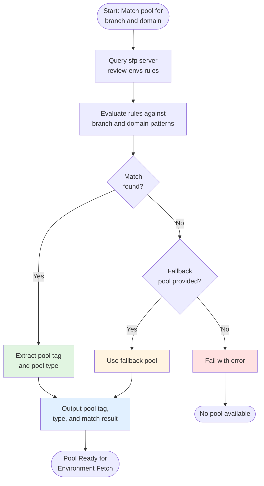

# Match Pool

The `matchPool` action provides dynamic pool selection based on configured assignment rules in sfp server. It enables sophisticated environment routing where different branches or domains can be assigned to different scratch org or sandbox pools.

## Overview

In complex Salesforce development environments, you may need different review environments for different scenarios - hotfix branches might need a dedicated pool, while feature branches use a shared pool. The match pool action provides:

* **Rule-based matching** using patterns configured in sfp server
* **Branch and domain awareness** for precise environment selection
* **Fallback support** when no rules match
* **Pool type detection** distinguishing scratch orgs from sandboxes

This makes it perfect for:

* Dynamic PR validation environment assignment
* Multi-tenant review environment strategies
* Branch-specific pool routing (hotfix vs feature)
* Domain-specific environment allocation
* Cost optimization through intelligent pool selection

## How It Works

The action queries sfp server's review environment rules API to find the best matching pool:



## Prerequisites

Before using this action:

1. **sfp server is configured** with review environment rules:
   * `SFP_SERVER_URL` as a variable
   * `SFP_SERVER_TOKEN` as a secret

2. **Pool assignment rules exist** in sfp server - Rules define which pools to use for which branch/domain combinations

3. **Your workflow uses the sfops Docker image**:

    ```yaml
    jobs:
      match-pool:
        runs-on: ubuntu-latest
        container: ${{ sfops.sfops_docker_image }}
    ```

## Referencing the Action

The `matchPool` action is located in your sfops repository:

```yaml
uses: ${{ sfops.repo_owner }}/${{ sfops.action_repository }}/matchPool@main
```

## Basic Usage

### Simple Pool Matching

Match a pool for PR validation:

```yaml
name: PR Validation
on:
  pull_request:
    branches: [main]

jobs:
  match-and-validate:
    runs-on: ubuntu-latest
    container: ${{ sfops.sfops_docker_image }}
    steps:
      - uses: actions/checkout@v4

      - name: Match Pool
        id: pool
        uses: ${{ sfops.repo_owner }}/${{ sfops.action_repository }}/matchPool@main
        with:
          repository: ${{ github.repository }}
          branch: ${{ github.head_ref }}
          domain: core
          sfp-server-url: ${{ vars.SFP_SERVER_URL }}
          sfp-server-token: ${{ secrets.SFP_SERVER_TOKEN }}

      - name: Display Match Result
        run: |
          echo "Pool: ${{ steps.pool.outputs.pool-tag }}"
          echo "Type: ${{ steps.pool.outputs.pool-type }}"
          echo "Matched: ${{ steps.pool.outputs.matched }}"
```

### With Fallback Pool

Provide a default pool when no rules match:

```yaml
- name: Match Pool with Fallback
  id: pool
  uses: ${{ sfops.repo_owner }}/${{ sfops.action_repository }}/matchPool@main
  with:
    repository: ${{ github.repository }}
    branch: ${{ github.head_ref }}
    domain: ${{ matrix.domain }}
    fallback-pool: default-review-pool
    sfp-server-url: ${{ vars.SFP_SERVER_URL }}
    sfp-server-token: ${{ secrets.SFP_SERVER_TOKEN }}
```

### Dynamic Domain Matching

Match pools for different domains in a matrix build:

```yaml
jobs:
  detect-domains:
    runs-on: ubuntu-latest
    outputs:
      domains: ${{ steps.detect.outputs.domains }}
    steps:
      - id: detect
        run: echo "domains=[\"core\",\"sales\",\"service\"]" >> $GITHUB_OUTPUT

  validate:
    needs: detect-domains
    runs-on: ubuntu-latest
    container: ${{ sfops.sfops_docker_image }}
    strategy:
      matrix:
        domain: ${{ fromJSON(needs.detect-domains.outputs.domains) }}
    steps:
      - uses: actions/checkout@v4

      - name: Match Pool for ${{ matrix.domain }}
        id: pool
        uses: ${{ sfops.repo_owner }}/${{ sfops.action_repository }}/matchPool@main
        with:
          repository: ${{ github.repository }}
          branch: ${{ github.head_ref }}
          domain: ${{ matrix.domain }}
          fallback-pool: shared-pool
          sfp-server-url: ${{ vars.SFP_SERVER_URL }}
          sfp-server-token: ${{ secrets.SFP_SERVER_TOKEN }}

      - name: Fetch Environment from Pool
        run: |
          sfp pool:fetch --tag ${{ steps.pool.outputs.pool-tag }}
```

## Input Reference

| Input              | Required | Default  | Description                                    |
| ------------------ | -------- | -------- | ---------------------------------------------- |
| `repository`       | Yes      | -        | Repository identifier (`owner/repo`)           |
| `branch`           | Yes      | -        | Branch to match against rules                  |
| `domain`           | Yes      | -        | Domain to match against rules                  |
| `fallback-pool`    | No       | -        | Pool to use if no rules match                  |
| `sfp-server-url`   | Yes      | -        | URL to sfp server instance                     |
| `sfp-server-token` | Yes      | -        | Authentication token for sfp server            |
| `sfp-cli-version`  | No       | `latest` | Version of sfp CLI to use                      |

## Output Reference

| Output         | Description                                  | Example                           |
| -------------- | -------------------------------------------- | --------------------------------- |
| `pool-tag`     | The matched or fallback pool tag             | `hotfix-pool`, `feature-pool`     |
| `pool-type`    | Type of pool                                 | `SANDBOX` or `SCRATCH_ORG`        |
| `matched`      | Whether a rule matched                       | `true` or `false`                 |
| `match-result` | Full match result as JSON                    | `{"matched":true,"poolTag":...}`  |

## Understanding Pool Assignment Rules

Pool assignment rules in sfp server define patterns for matching branches and domains to pools. Rules are evaluated in priority order.

### Rule Structure

Rules typically include:

* **Branch pattern**: Regex or glob pattern matching branch names
* **Domain pattern**: Regex or glob pattern matching domain names
* **Pool tag**: The pool to assign when rule matches
* **Pool type**: SANDBOX or SCRATCH_ORG
* **Priority**: Order of evaluation (higher priority wins)

### Example Rules

```
Rule 1 (Priority: 100):
  Branch: hotfix/*
  Domain: *
  Pool: hotfix-sandbox-pool
  Type: SANDBOX

Rule 2 (Priority: 50):
  Branch: release/*
  Domain: core
  Pool: release-core-pool
  Type: SANDBOX

Rule 3 (Priority: 10):
  Branch: *
  Domain: *
  Pool: default-scratch-pool
  Type: SCRATCH_ORG
```

With these rules:
- `hotfix/urgent-fix` + any domain → `hotfix-sandbox-pool`
- `release/v2.0` + `core` domain → `release-core-pool`
- `feature/new-feature` + `sales` domain → `default-scratch-pool`

## Common Use Cases

### Hotfix Priority Routing

Route hotfix branches to dedicated pools:

```yaml
- name: Match Pool
  id: pool
  uses: ${{ sfops.repo_owner }}/${{ sfops.action_repository }}/matchPool@main
  with:
    repository: ${{ github.repository }}
    branch: ${{ github.head_ref }}
    domain: ${{ steps.impact.outputs.primary-domain }}
    sfp-server-url: ${{ vars.SFP_SERVER_URL }}
    sfp-server-token: ${{ secrets.SFP_SERVER_TOKEN }}

- name: Log Pool Assignment
  run: |
    if [[ "${{ steps.pool.outputs.pool-tag }}" == *"hotfix"* ]]; then
      echo "::notice::Using hotfix pool for priority validation"
    fi
```

### Domain-Specific Environments

Use different pools for different domains:

```yaml
jobs:
  validate-domains:
    runs-on: ubuntu-latest
    container: ${{ sfops.sfops_docker_image }}
    strategy:
      matrix:
        domain: [core, sales, service, analytics]
    steps:
      - name: Match Pool for ${{ matrix.domain }}
        id: pool
        uses: ${{ sfops.repo_owner }}/${{ sfops.action_repository }}/matchPool@main
        with:
          repository: ${{ github.repository }}
          branch: ${{ github.head_ref }}
          domain: ${{ matrix.domain }}
          fallback-pool: shared-pool
          sfp-server-url: ${{ vars.SFP_SERVER_URL }}
          sfp-server-token: ${{ secrets.SFP_SERVER_TOKEN }}

      # Each domain may get a different pool based on rules
      - name: Validate in ${{ steps.pool.outputs.pool-tag }}
        run: |
          echo "Validating ${{ matrix.domain }} in pool ${{ steps.pool.outputs.pool-tag }}"
```

### Conditional Workflow Based on Pool Type

Adjust workflow based on whether pool is sandbox or scratch org:

```yaml
- name: Match Pool
  id: pool
  uses: ${{ sfops.repo_owner }}/${{ sfops.action_repository }}/matchPool@main
  with:
    repository: ${{ github.repository }}
    branch: ${{ github.head_ref }}
    domain: core
    sfp-server-url: ${{ vars.SFP_SERVER_URL }}
    sfp-server-token: ${{ secrets.SFP_SERVER_TOKEN }}

- name: Fetch Sandbox
  if: steps.pool.outputs.pool-type == 'SANDBOX'
  run: |
    sfp pool:fetch --tag ${{ steps.pool.outputs.pool-tag }} --sandbox

- name: Fetch Scratch Org
  if: steps.pool.outputs.pool-type == 'SCRATCH_ORG'
  run: |
    sfp pool:fetch --tag ${{ steps.pool.outputs.pool-tag }}
```

### Full Match Result Processing

Access the complete match result for advanced scenarios:

```yaml
- name: Match Pool
  id: pool
  uses: ${{ sfops.repo_owner }}/${{ sfops.action_repository }}/matchPool@main
  with:
    repository: ${{ github.repository }}
    branch: ${{ github.head_ref }}
    domain: core
    sfp-server-url: ${{ vars.SFP_SERVER_URL }}
    sfp-server-token: ${{ secrets.SFP_SERVER_TOKEN }}

- name: Process Match Result
  run: |
    RESULT='${{ steps.pool.outputs.match-result }}'
    echo "Full result: $RESULT"

    # Extract additional details if needed
    RULE_NAME=$(echo "$RESULT" | jq -r '.assignment.ruleName // "fallback"')
    echo "Matched rule: $RULE_NAME"
```

## Best Practices

### Always Provide Fallback Pools

Ensure workflows don't fail when no rules match:

```yaml
with:
  fallback-pool: default-review-pool  # Always have a fallback
```

### Use Descriptive Pool Tags

Configure pools with meaningful names:

```
Good: hotfix-sandbox-pool, feature-scratch-pool, release-qa-sandbox
Avoid: pool1, test, temp
```

### Log Pool Assignments

Add visibility into pool selection for debugging:

```yaml
- name: Log Pool Assignment
  run: |
    echo "Branch: ${{ github.head_ref }}"
    echo "Domain: ${{ matrix.domain }}"
    echo "Pool: ${{ steps.pool.outputs.pool-tag }}"
    echo "Matched: ${{ steps.pool.outputs.matched }}"
```

## Troubleshooting

### No Match Found

If matching fails without a fallback:

1. Verify rules exist in sfp server for the branch/domain combination
2. Check branch name matches rule patterns (case-sensitive)
3. Ensure domain name is correct
4. Add a fallback pool for safety

### Wrong Pool Selected

If unexpected pool is assigned:

1. Review rule priorities in sfp server
2. Check for overlapping patterns
3. Verify branch and domain values being passed
4. Review `match-result` output for debugging

### Authentication Errors

If sfp server connection fails:

1. Verify `SFP_SERVER_URL` is correct
2. Check `SFP_SERVER_TOKEN` is valid and not expired
3. Ensure the token has permissions for review-envs API
