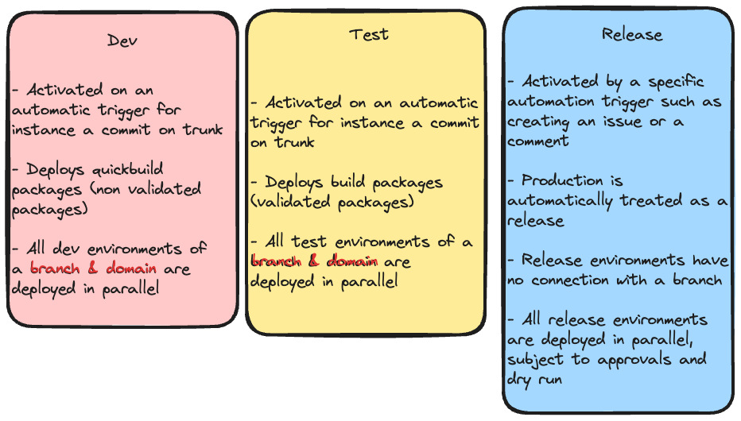

# Environments

This section details on how environments are operated in the context of sfops. An environment is backed by a Salesforce sandbox and few additional metadata. An environment can be created or deleted dynamically and can be associated with a stage in the pipeline such as 'development', 'test' or 'release'

sfops follow the environment strategy as mentioned in the 'flxbl' framework. You can read more details [here](https://app.gitbook.com/s/81CMYlxTEobShX3WGZxY/techniques/environment-management).  To recap the environments used in sfops, please see the categories below

<figure><figcaption></figcaption></figure>

In addition to the above categories,  flxbl project  utilize  three categories of development  environments\
\

<figure><figcaption></figcaption></figure>

