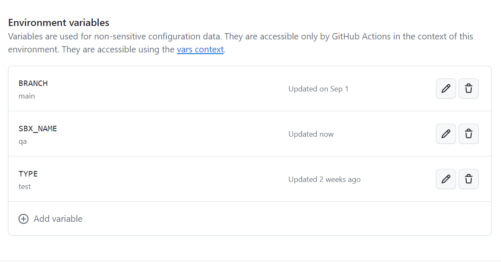
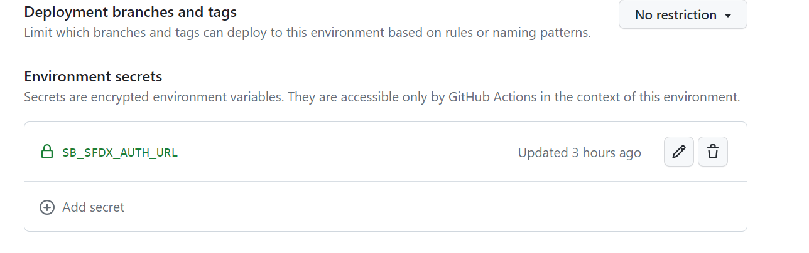

# Authenticating to Environments

Environments in sfops are authenticated using the credentials stored in Github. This section describes the various mechanisms used for authenticating environments

### Authenticating to Production Environment

If your DevHub and Production are the same org (typical for most organizations), authentication uses the existing `DEVHUB_SFDX_AUTH_URL` secret - no additional configuration needed.

If your Production org is different from your DevHub (less common), you need to:
1. Create a GitHub Environment named 'PROD'
2. Add an environment secret titled `SFDX_AUTH_URL` with the Production org's auth URL value

### Authenticating to Other Environments

Authenticating to any other environments backed by a sandbox depends on how the sandbox is being created. Choose the appropriate method below:

#### Option 1: Sandboxes created by the DevHub user configured in GitHub

Sandboxes created by the DevHub user (the CI/CD user authenticated via DEVHUB_SFDX_AUTH_URL) can be authenticated by using the sandbox name. All that is required is setting up the SBX\_NAME variable in the environment as shown below:

<figure><figcaption><p>Use of SBX_NAME in Authentication</p></figcaption></figure>


Please note, when a sandbox is refreshed from the UI, irrespective of whether the action was done by the same user configured in Github, sfops will not be able to authenticate to this environment, and you will need to provide SB\_SFDX\_AUTH\_URL as mentioned in Option 2.


---

#### Option 2: Sandboxes created by any other users in production

To authenticate a sandbox that was not created by the DevHub user configured in GitHub (the CI/CD user authenticated via DEVHUB_SFDX_AUTH_URL), one needs to provide an environment secret **SB\_SFDX\_AUTH\_URL** which can be obtained by using the instructions [here.](https://docs.flxbl.io/sfp/pools/setting-up-your-salesforce-org-for-scratch-org-pools#generate-sfdx-auth-url-for-pipeline-authentication)

<figure><figcaption></figcaption></figure>

---

### Authentication for Daily Test Runs

Daily test runs require special authentication configuration for organizations using **sfp community** or **sfp pro without sfp server**. Organizations that have fully onboarded to **sfp pro with sfp server** can skip the GitHub secrets configuration and use the simpler server-based approach.

#### GitHub Secrets Based Authentication (sfp community / sfp pro without server)

For GitHub secrets based daily test runs, you need to:

1. **Add repository secrets** for each environment using the exact format: `<ENVIRONMENT_NAME>_SFDX_AUTH_URL`
2. **Pass these secrets** in your daily test workflow

**Important Limitation**: Due to how GitHub Actions handles secrets in reusable workflows, **only these specific environment names and their corresponding secrets are supported**:

| GitHub Environment Name | Required Repository Secret |
|-------------------------|----------------------------|
| **STAGING**             | `STAGING_SFDX_AUTH_URL`    |
| **SIT**                 | `SIT_SFDX_AUTH_URL`        |
| **PREPROD**             | `PREPROD_SFDX_AUTH_URL`    |
| **UAT**                 | `UAT_SFDX_AUTH_URL`        |
| **QA**                  | `QA_SFDX_AUTH_URL`         |
| **IQA**                 | `IQA_SFDX_AUTH_URL`        |


**Custom environment names are not supported in automated workflows**

If you have a sandbox with a custom name (e.g., "myawesomestagingorg"), you must rename it to one of the supported names above (e.g., "STAGING") for daily test runs to work.

This limitation exists because the workflow cannot dynamically pass arbitrary secrets, and only the predefined environment names are configured.


**Selecting Which Environments to Test**

For GitHub secrets based authentication, environments are selected based on GitHub environment variables:
1. Create GitHub environments with one of the supported names (STAGING, SIT, PREPROD, UAT, QA, IQA)
2. Add a variable `TESTRUN=true` to each environment you want to include in daily test runs
3. The workflow will automatically discover and test all environments with `TESTRUN=true`


**Remember to update your project workflow**

If you use any of the supported environments (STAGING, SIT, PREPROD, UAT, QA, IQA), you must update your `sfops-cron-daily-quality-test.yml` workflow to include the corresponding auth URL secret in the secrets section.


Example daily test workflow configuration:
```yaml
apex-test-runs:
  uses: ./.github/workflows/apex-test-on-test-envs.yml@main
  secrets:
    DEVHUB_SFDX_AUTH_URL: ${{ secrets.DEVHUB_SFDX_AUTH_URL }}
    STAGING_SFDX_AUTH_URL: ${{ secrets.STAGING_SFDX_AUTH_URL }}  # Add if you have STAGING environment
    UAT_SFDX_AUTH_URL: ${{ secrets.UAT_SFDX_AUTH_URL }}          # Add if you have UAT environment
    # Add other environment secrets as needed
    DATADOG_API_KEY: ${{ secrets.DATADOG_API_KEY }}
    DATADOG_HOST: ${{ secrets.DATADOG_HOST }}
    SFOPSBOT_APP_PRIVATE_KEY: ${{ secrets.SFOPSBOT_APP_PRIVATE_KEY }}
    NPM_TOKEN: ${{ secrets.GITHUB_TOKEN }}
```

#### sfp server Based Authentication (sfp pro with server)

For sfp server based daily test runs:
- Authentication is managed centrally through sfp server
- No need for individual environment secrets in GitHub
- Supports any environment name without restrictions
- Auth URLs are stored and retrieved dynamically from sfp server


**No naming restrictions with sfp server**

sfp server removes the environment naming limitations. You can use any sandbox name and the authentication will work seamlessly for daily test runs.


**Selecting Which Environments to Test**

The workflow automatically tests all environments that have the metadata `testrun: true` set in the sfp server.

To configure which environments are included in daily test runs, you have three options:

1. **Using codev**: Manage environments through the graphical interface in codev desktop application

2. **Using sfp CLI**: Create environments with `--metadata '{"testrun": "true"}'`
   See [sfp Environment documentation](https://docs.flxbl.io/sfp/cli-reference/server/environment) for complete CLI reference.

3. **Using sfp server REST API**: Update environment metadata directly via API
```bash
# Update existing environment metadata via REST API
curl -X PATCH https://your-sfp-server.com/environments/{environmentId} \
  -H "Authorization: Bearer <token>" \
  -H "Content-Type: application/json" \
  -d '{"metadata": {"testrun": "true"}}'
```
   See [sfp server API documentation](https://docs.flxbl.io/flxbl/sfp-server/api-reference/environments) for complete API reference.

To view which environments will be tested:
```bash
sfp server environment list --repository <owner/repo> --metadata "testrun=true"
```

Example daily test workflow configuration:
```yaml
apex-test-runs:
  uses: ./.github/workflows/apex-test-on-test-envs-v2.yml@main
  with:
    sfp-server-url: ${{ vars.SFP_SERVER_URL }}
  secrets:
    DEVHUB_SFDX_AUTH_URL: ${{ secrets.DEVHUB_SFDX_AUTH_URL }}
    SFP_SERVER_TOKEN: ${{ secrets.SFP_SERVER_TOKEN }}
# This workflow will automatically run tests on all environments
# with metadata testrun=true (e.g., my-awesome-staging-org, my-awesome-uat-org)
```