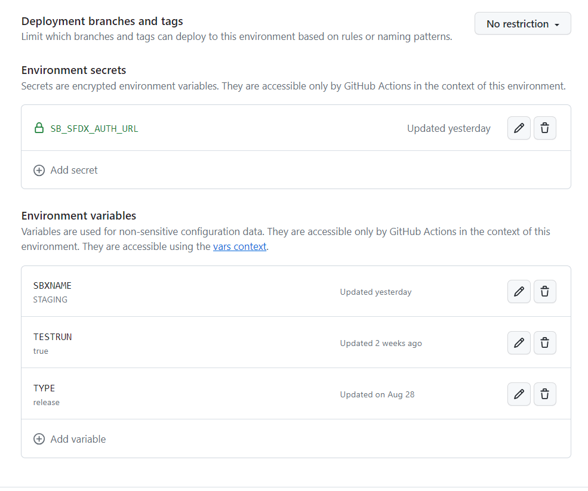

---
layout:
  title:
    visible: true
  description:
    visible: false
  tableOfContents:
    visible: true
  outline:
    visible: true
  pagination:
    visible: true
---

# Creating an Environment

Environments in sfops is tied to GitHub Environments ([https://docs.github.com/en/actions/deployment/targeting-different-environments/using-environments-for-deployment](https://docs.github.com/en/actions/deployment/targeting-different-environments/using-environments-for-deployment)) with additional metadata such as described below\

<figure><figcaption></figcaption></figure>

<table><thead><tr><th width="139">Name</th><th width="143.33333333333331">Type</th><th>Purpose</th></tr></thead><tbody><tr><td>SBXNAME</td><td>variable : string</td><td>(Optional) Stores the name of the sandbox associated with the environment. If SB_SFDX_AUTH_URL is not provided use, the name to handle authentication. Read more <a href="authenticating-to-environments.md">here</a></td></tr><tr><td>TESTRUN</td><td>variable : boolean</td><td>Use this environment for daily full test tuns by a scheduled sfops workflow</td></tr><tr><td>TYPE</td><td>variable : string</td><td>Denotes the type of the environment, an environment could be one of 'development', 'test' or 'release'</td></tr><tr><td>SB_SFDX_AUTH_URL</td><td>secret : string</td><td>Auth URL to the environment, Read <a href="authenticating-to-environments.md">here </a>on how to generate one</td></tr><tr><td>BRANCH</td><td>variable:string</td><td>Required for test and snapshot environments. This variable denote the branch which environment is associated with.</td></tr></tbody></table>

\
Environments added to GitHub will be displayed in Environment Snapshot in sfops Dev Central as shown below

<figure><figcaption></figcaption></figure>

Environments can be created from dev central by  using the `add` icon in each of the category. One could also use the    '**Request a new environment**', from the service catalogue directly, where you could fill in the details, and the environment gets created. Please note the sandbox has to be created previously before triggering the request.

<figure><figcaption></figcaption></figure>
