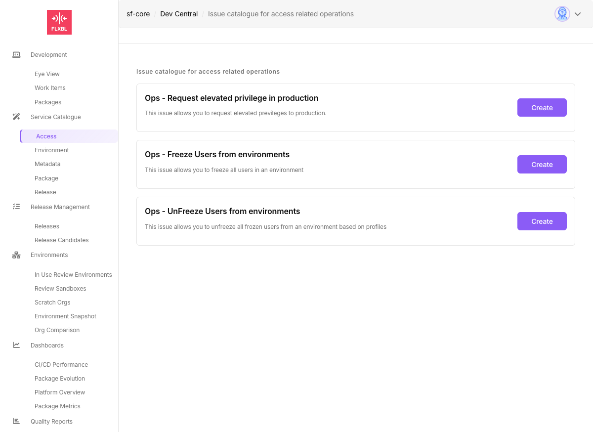
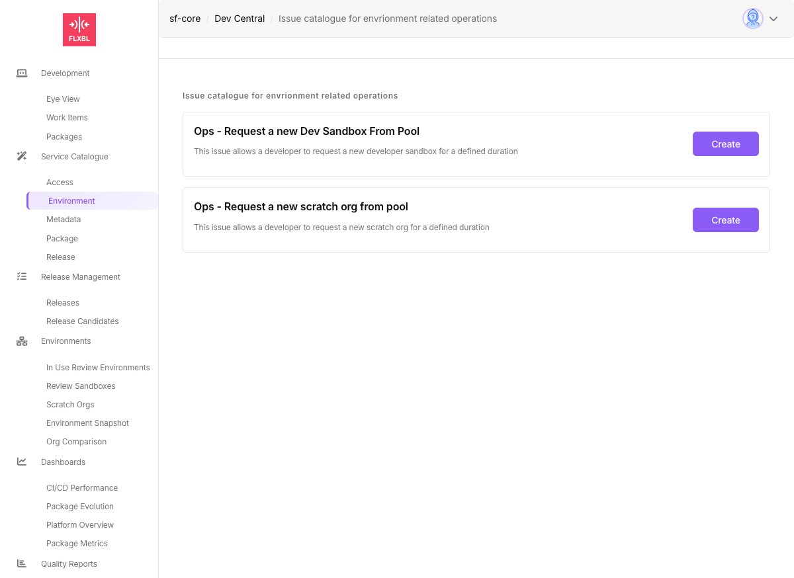
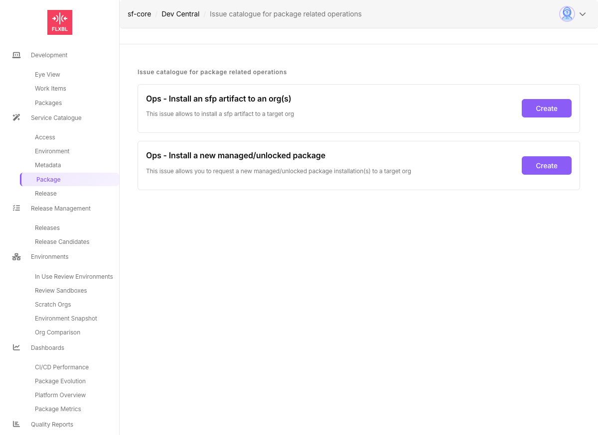
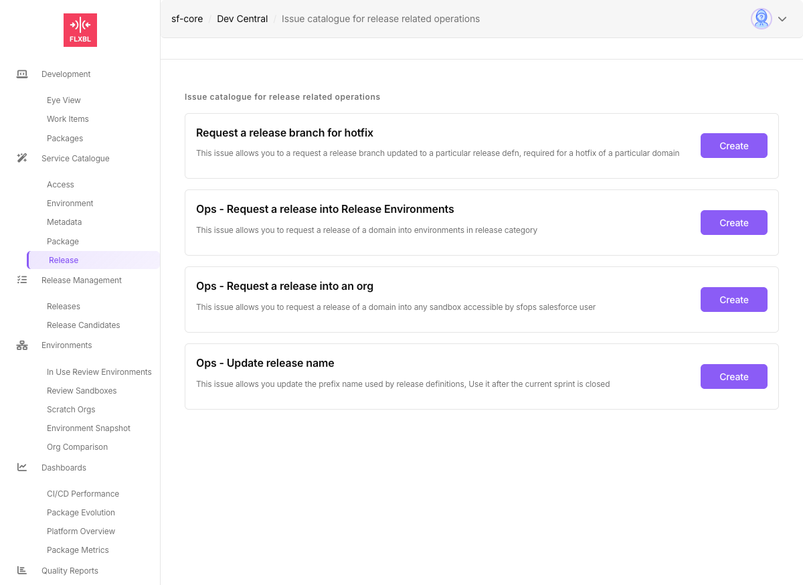

# IssueOps

## Overview

IssueOps are GitHub issue-driven operations that enable self-service automation through structured issue templates. Teams can request operations like environment provisioning, package installations, release management, and access control directly through GitHub issues, without requiring manual intervention or direct repository access.

When users create issues with specific structured data, automated workflows process these requests, execute the necessary operations, provide feedback through comments, and automatically close the issues upon completion.

## How IssueOps Work

### Architecture Flow

```
GitHub Issue (with structured JSON payload)
        ↓
Issue Analyzer (GitHub Actions workflow)
        ↓
IssueExecutorRegistry (maps issue ID to executor)
        ↓
Executor processes request
        ↓
Updates issue with progress comments
        ↓
Success/Failure notification & Issue closure
```

### Key Components

1. **Issue Forms**: User-friendly YAML-based forms in DevCentral that generate structured JSON payloads
2. **Issue Analyzer**: GitHub Actions workflow that identifies and validates IssueOps requests
3. **Executors**: TypeScript classes that handle specific operations
4. **Job System**: Manages long-running operations with polling and delayed execution
5. **Feedback System**: Provides real-time updates via GitHub issue comments

## Available IssueOps Categories

sfops provides 14 built-in IssueOps executors organized into the following categories:

### Access Management
Control user access and permissions across Salesforce environments



- **Request Elevated Privileges**: Grant temporary elevated access to production environments
- **Freeze Users**: Freeze users by profile in specified environments
- **Unfreeze Users**: Unfreeze previously frozen users based on profiles

[Learn more about Access IssueOps →](access/)

### Environment Management
Provision and manage development environments



- **Request Dev Sandbox from Pool**: Get a developer sandbox for a defined duration
- **Request Scratch Org from Pool**: Provision a scratch org from the pool
- **Request GitHub Environment**: Create GitHub environment variables with approval settings
- **Delete Environment**: Remove GitHub environments

[Learn more about Environment IssueOps →](environment/)

### Package Management
Deploy packages and artifacts to Salesforce orgs



- **Install sfp Artifact**: Deploy built sfp artifacts to target orgs
- **Install Managed/Unlocked Package**: Install Salesforce packages using version IDs

[Learn more about Package IssueOps →](package/)

### Release Management
Manage releases and deployments across environments



- **Request Release Branch for Hotfix**: Create patch release branches for hotfixes
- **Request Release to Environments**: Deploy releases to environments in release category
- **Request Release to Any Org**: Deploy to any accessible sandbox
- **Update Release Name**: Update the release name prefix after sprint closure

[Learn more about Release IssueOps →](release/)

## How IssueOps Process Requests

### 1. Issue Creation
Users create issues through DevCentral forms or directly with JSON payloads:

```html
<!--
{
  "id": "request-scratchorg",
  "tag": "dev",
  "daysToKeep": 7,
  "email": "developer@company.com"
}
-->
```

### 2. Validation & Processing
The Issue Analyzer workflow:
- Validates the JSON payload structure
- Checks for duplicate processing
- Maps the request to the appropriate executor
- Triggers the executor with the payload data

### 3. Execution
The executor:
- Posts a "processing" comment to the issue
- Performs the requested operation
- Handles errors gracefully with detailed feedback
- Updates issue labels for tracking

### 4. Completion
Upon completion:
- Posts success/failure message with results
- Stores context for future reference
- Automatically closes the issue
- Triggers any follow-up jobs if needed

## Building Custom IssueOps

Create custom IssueOps using GitHub Actions workflows - no sfp modifications required.

### Quick Example

Create a workflow that responds to issues with your custom JSON payload:

```yaml
name: My Custom IssueOps

on:
  issues:
    types: [opened]

jobs:
  process:
    if: contains(github.event.issue.body, '"id":"my-custom-action"')
    runs-on: ubuntu-latest
    steps:
      - name: Parse and Execute
        uses: actions/github-script@v7
        with:
          script: |
            // Parse JSON from issue body
            const match = context.payload.issue.body.match(/<!--\s*({[\s\S]*?})\s*-->/);
            const payload = JSON.parse(match[1]);

            // Post progress comment
            await github.rest.issues.createComment({
              owner: context.repo.owner,
              repo: context.repo.repo,
              issue_number: context.issue.number,
              body: '🔄 Processing your request...'
            });

            // Your custom logic here
            console.log('Processing:', payload);

            // Close issue on success
            await github.rest.issues.update({
              owner: context.repo.owner,
              repo: context.repo.repo,
              issue_number: context.issue.number,
              state: 'closed'
            });
```

[Learn more about building custom IssueOps →](building-custom-issueops.md)

## Best Practices

### Security
- Always validate input data in executors
- Use GitHub App tokens for authentication
- Limit permissions to minimum required
- Store sensitive data in GitHub secrets

### Error Handling
- Provide clear error messages
- Include remediation steps
- Log detailed information for debugging
- Use try-catch blocks consistently

### User Experience
- Create intuitive form fields
- Add helpful descriptions and examples
- Provide real-time status updates
- Include success confirmation details

### Monitoring
- Use labels for tracking issue states
- Implement timeout mechanisms
- Clean up stale jobs automatically
- Monitor execution metrics

## Troubleshooting

### Common Issues

**Issue not being processed:**
- Verify JSON payload is properly formatted
- Check issue ID is included in workflow configuration
- Ensure GitHub App has necessary permissions

**Executor fails with error:**
- Review error message in issue comments
- Check executor logs in Actions tab
- Verify required secrets and variables exist

**Long-running operations timeout:**
- Adjust `jobPollInterval` and timeout settings
- Consider breaking operation into smaller steps
- Implement proper cleanup handlers

## Next Steps

- [Configure Access IssueOps](access/)
- [Setup Environment IssueOps](environment/)
- [Deploy with Package IssueOps](package/)
- [Manage Releases with IssueOps](release/)
- [Build Custom IssueOps](../devcentral/extending-using-custom-forms-and-issue-ops-actions.md)