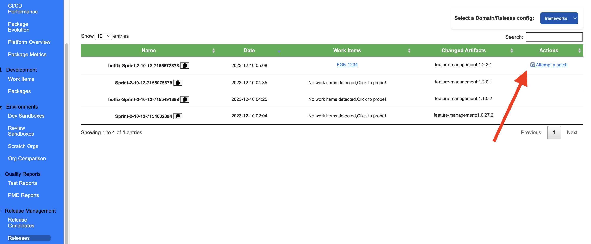

# Hotfix Workflow

This section explains how a hotfix if required could be applied in the context of sfops. These workflows automate the process of patching an existing active branch (e.g. main), to create a dynamic release branch for applying your patches.

This process could be used for an accelerated delivery to release changes to **RELEASE** environments. As of v31.6.0, hotfixes can now be initiated directly from release candidates in DevCentral, not just from completed releases


Please note hotfix is an anti-pattern and should not be used. We only advise this feature for teams who are on their journey to continuous deployment


### Hotfix Process

#### Step 1: Activate Apply a Patch action in sfops dev central

<figure><figcaption>
Click on Attempt a Patch
</figcaption></figure>

Starting from v31.6.0, you can now initiate hotfixes directly from release candidates, not just from completed releases. This provides more flexibility in emergency situations.

sfops will attempt to patch the branch which the release candidate was created on by resetting the commits to the exact stage where the candidate was created. This is only applied on the selected domain. If there are multiple domain, please proceed each one individually.

#### Step 2: Create and Validate a Hotfix Pull Request

Create a Pull Request against the newly created release branch with your hotfix changes. This change is validated against a review sandbox environment created against production. Once the validation is successful and the changes have been peer-reviewed, the Pull Request can be merged.

#### Step 3: Build and Cherry-Pick the Hotfix

Upon merging the Pull Request, the ["Build, Deploy & Publish"](../../project-workflows/build-deploy-and-publish.md) workflow will be executed. The workflow uses the respective release branch that was created.

This workflow will build and publish the updated packages to be included in the release. Additionally, an automated cherry-picker process will create a new Pull Request against the main branch with the hotfix changes.

It's crucial to review this automated cherry-pick Pull Request on priority. The decision to merge or not depends on the change and what's currently in flight. This step ensures that the hotfix is also applied to the main branch, allowing the changes to persist in future releases.

#### Step 4: Release to Release Environments

Once the hotfix is ready, you can manually trigger a release of the newly created release definition from the sfops dev central to release the hotfix to the Release environments  (environments assigned to release category).

This will release the patched versions to release environments, with the newly built hotfix included.

Please note, if say one of the environment, say STAGING  is currently testing an inflight release, you might choose to skip the STAGING environment and directly release the hotfix to the PROD  as an example.
