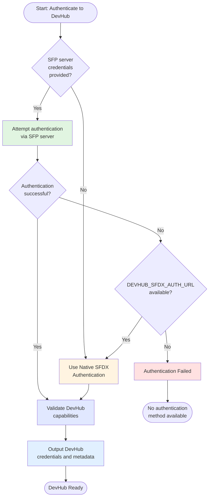

# Using Hybrid DevHub Authentication in Custom Workflows

The `authToDevHubHybrid` action provides flexible DevHub authentication for custom workflows. It automatically attempts to authenticate via SFP server first, then falls back to native SFDX authentication if needed. This ensures your workflows can authenticate to DevHub regardless of whether it's managed by SFP server or configured with native credentials.

## Overview

DevHub authentication is essential for many Salesforce development operations like creating scratch orgs, managing packages, and running CI/CD pipelines. The hybrid DevHub authentication action provides:

- **Automatic authentication method selection** between SFP server and native SFDX
- **Seamless fallback mechanism** if SFP server authentication fails
- **Zero configuration changes** when switching between authentication methods
- **Consistent outputs** regardless of the authentication method used
- **DevHub validation** to ensure the authenticated org is a valid DevHub

This makes it perfect for:
- Scratch org creation workflows
- Package development and versioning
- Unlocked package operations
- 2GP (Second Generation Package) workflows
- Custom CI/CD pipelines
- Development environment provisioning

## How It Works

The action follows an intelligent authentication flow:



## Prerequisites

Before using this action in your custom workflow, ensure:

1. **Your workflow uses the sfops Docker image** - Required for SFP CLI and dependencies:
   ```yaml
   jobs:
     your-job:
       runs-on: ubuntu-latest
       container: ${{ sfops.sfops_docker_image }}
   ```

2. **At least one authentication method is configured**:
   - **For SFP server**: `SFP_SERVER_URL` (variable) and `SFP_SERVER_TOKEN` (secret)
   - **For native auth**: `DEVHUB_SFDX_AUTH_URL` (secret)
   - **For maximum flexibility**: Configure both methods

3. **DevHub is properly configured** - The target org must have DevHub features enabled

## Referencing the Action

The `authToDevHubHybrid` action is located in your sfops repository. In all examples below, the action is referenced using:

```yaml
uses: ${{ sfops.repo_owner }}/${{ sfops.action_repository }}/authToDevHubHybrid@main
```

The `${{ sfops.repo_owner }}/${{ sfops.action_repository }}` template variables are automatically replaced with your organization and sfops repository name (e.g., `flxbl-io/sfops-gh-actions`).

## Basic Usage

### Simple DevHub Authentication

Minimal configuration that works with either authentication method:

```yaml
name: Create Scratch Org
on:
  workflow_dispatch:
    inputs:
      duration:
        description: 'Scratch org duration (days)'
        required: true
        default: '7'

jobs:
  create-scratch-org:
    runs-on: ubuntu-latest
    container: ${{ sfops.sfops_docker_image }}
    steps:
      - name: Checkout
        uses: actions/checkout@v4

      - name: Authenticate to DevHub
        id: devhub
        uses: ${{ sfops.repo_owner }}/${{ sfops.action_repository }}/authToDevHubHybrid@main
        with:
          repository: ${{ github.repository }}
          sfp-server-url: ${{ vars.SFP_SERVER_URL }}
          sfp-server-token: ${{ secrets.SFP_SERVER_TOKEN }}
          DEVHUB_SFDX_AUTH_URL: ${{ secrets.DEVHUB_SFDX_AUTH_URL }}

      - name: Create Scratch Org
        run: |
          sfdx force:org:create \
            --targetdevhubusername ${{ steps.devhub.outputs.alias }} \
            --definitionfile config/project-scratch-def.json \
            --durationdays ${{ inputs.duration }} \
            --setalias my-scratch-org \
            --json
```

### With Custom Alias

Specify a custom alias for the DevHub:

```yaml
- name: Authenticate to DevHub
  id: devhub
  uses: ${{ sfops.repo_owner }}/${{ sfops.action_repository }}/authToDevHubHybrid@main
  with:
    repository: ${{ github.repository }}
    alias: my-devhub  # Custom alias instead of default "devhub"
    sfp-server-url: ${{ vars.SFP_SERVER_URL }}
    sfp-server-token: ${{ secrets.SFP_SERVER_TOKEN }}
    DEVHUB_SFDX_AUTH_URL: ${{ secrets.DEVHUB_SFDX_AUTH_URL }}
```

### SFP Server Only Configuration

When you only use SFP server for DevHub management:

```yaml
- name: Authenticate to DevHub (SFP Server)
  id: devhub
  uses: ${{ sfops.repo_owner }}/${{ sfops.action_repository }}/authToDevHubHybrid@main
  with:
    repository: ${{ github.repository }}
    sfp-server-url: ${{ vars.SFP_SERVER_URL }}
    sfp-server-token: ${{ secrets.SFP_SERVER_TOKEN }}
    # No DEVHUB_SFDX_AUTH_URL - will fail if SFP auth fails
```

### Native Only Configuration

When you only use native SFDX authentication:

```yaml
- name: Authenticate to DevHub (Native)
  id: devhub
  uses: ${{ sfops.repo_owner }}/${{ sfops.action_repository }}/authToDevHubHybrid@main
  with:
    repository: ${{ github.repository }}
    DEVHUB_SFDX_AUTH_URL: ${{ secrets.DEVHUB_SFDX_AUTH_URL }}
    # No SFP server credentials - will use native auth directly
```

## Advanced Usage

### Package Version Creation

Complete workflow for creating a new package version:

```yaml
name: Create Package Version
on:
  workflow_dispatch:
    inputs:
      package_name:
        description: 'Package name'
        required: true
        type: choice
        options:
          - core-package
          - ui-components
          - integration-layer

jobs:
  create-version:
    runs-on: ubuntu-latest
    container: ${{ sfops.sfops_docker_image }}
    steps:
      - name: Checkout
        uses: actions/checkout@v4

      - name: Authenticate to DevHub
        id: devhub
        uses: ${{ sfops.repo_owner }}/${{ sfops.action_repository }}/authToDevHubHybrid@main
        with:
          repository: ${{ github.repository }}
          sfp-server-url: ${{ vars.SFP_SERVER_URL }}
          sfp-server-token: ${{ secrets.SFP_SERVER_TOKEN }}
          DEVHUB_SFDX_AUTH_URL: ${{ secrets.DEVHUB_SFDX_AUTH_URL }}

      - name: Check Authentication Method
        run: |
          echo "DevHub authenticated using: ${{ steps.devhub.outputs.auth_method }}"
          echo "DevHub Org ID: ${{ steps.devhub.outputs.org_id }}"
          echo "API Version: ${{ steps.devhub.outputs.api_version }}"

      - name: Create Package Version
        id: package
        run: |
          # Create new package version
          result=$(sfdx force:package:version:create \
            --targetdevhubusername ${{ steps.devhub.outputs.alias }} \
            --package ${{ inputs.package_name }} \
            --installationkeybypass \
            --wait 30 \
            --json)

          version_id=$(echo $result | jq -r '.result.SubscriberPackageVersionId')
          echo "version_id=$version_id" >> $GITHUB_OUTPUT

      - name: Promote if Successful
        if: success()
        run: |
          sfdx force:package:version:promote \
            --targetdevhubusername ${{ steps.devhub.outputs.alias }} \
            --package ${{ steps.package.outputs.version_id }} \
            --noprompt
```

### Multi-Scratch Org Creation

Create multiple scratch orgs in parallel:

```yaml
name: Create Development Environment
on:
  workflow_dispatch:

jobs:
  authenticate-devhub:
    runs-on: ubuntu-latest
    container: ${{ sfops.sfops_docker_image }}
    outputs:
      devhub_alias: ${{ steps.devhub.outputs.alias }}
      auth_method: ${{ steps.devhub.outputs.auth_method }}
    steps:
      - name: Checkout
        uses: actions/checkout@v4

      - name: Authenticate to DevHub
        id: devhub
        uses: ${{ sfops.repo_owner }}/${{ sfops.action_repository }}/authToDevHubHybrid@main
        with:
          repository: ${{ github.repository }}
          sfp-server-url: ${{ vars.SFP_SERVER_URL }}
          sfp-server-token: ${{ secrets.SFP_SERVER_TOKEN }}
          DEVHUB_SFDX_AUTH_URL: ${{ secrets.DEVHUB_SFDX_AUTH_URL }}

  create-scratch-orgs:
    needs: authenticate-devhub
    runs-on: ubuntu-latest
    container: ${{ sfops.sfops_docker_image }}
    strategy:
      matrix:
        org_type: [dev, qa, integration]
    steps:
      - name: Checkout
        uses: actions/checkout@v4

      - name: Re-authenticate to DevHub
        uses: ${{ sfops.repo_owner }}/${{ sfops.action_repository }}/authToDevHubHybrid@main
        with:
          repository: ${{ github.repository }}
          alias: ${{ needs.authenticate-devhub.outputs.devhub_alias }}
          sfp-server-url: ${{ vars.SFP_SERVER_URL }}
          sfp-server-token: ${{ secrets.SFP_SERVER_TOKEN }}
          DEVHUB_SFDX_AUTH_URL: ${{ secrets.DEVHUB_SFDX_AUTH_URL }}

      - name: Create ${{ matrix.org_type }} Scratch Org
        run: |
          sfdx force:org:create \
            --targetdevhubusername ${{ needs.authenticate-devhub.outputs.devhub_alias }} \
            --definitionfile config/${{ matrix.org_type }}-scratch-def.json \
            --durationdays 7 \
            --setalias ${{ matrix.org_type }}-org \
            --json
```

### Package Dependency Installation

Install package dependencies from DevHub:

```yaml
name: Setup Scratch Org with Dependencies
on:
  workflow_dispatch:

jobs:
  setup-org:
    runs-on: ubuntu-latest
    container: ${{ sfops.sfops_docker_image }}
    steps:
      - name: Checkout
        uses: actions/checkout@v4

      - name: Authenticate to DevHub
        id: devhub
        uses: ${{ sfops.repo_owner }}/${{ sfops.action_repository }}/authToDevHubHybrid@main
        with:
          repository: ${{ github.repository }}
          sfp-server-url: ${{ vars.SFP_SERVER_URL }}
          sfp-server-token: ${{ secrets.SFP_SERVER_TOKEN }}
          DEVHUB_SFDX_AUTH_URL: ${{ secrets.DEVHUB_SFDX_AUTH_URL }}

      - name: Create Scratch Org
        id: scratch
        run: |
          result=$(sfdx force:org:create \
            --targetdevhubusername ${{ steps.devhub.outputs.alias }} \
            --definitionfile config/project-scratch-def.json \
            --durationdays 1 \
            --setalias scratch-org \
            --json)

          username=$(echo $result | jq -r '.result.username')
          echo "username=$username" >> $GITHUB_OUTPUT

      - name: Install Dependencies
        run: |
          # Read package dependencies from sfdx-project.json
          dependencies=$(jq -r '.packageDirectories[0].dependencies // []' sfdx-project.json)

          if [ ! -z "$dependencies" ]; then
            echo "$dependencies" | jq -c '.[]' | while read dep; do
              package=$(echo $dep | jq -r '.package')
              version=$(echo $dep | jq -r '.versionNumber // "LATEST"')

              echo "Installing $package version $version"
              sfdx force:package:install \
                --targetusername ${{ steps.scratch.outputs.username }} \
                --package "$package@$version" \
                --wait 20 \
                --noprompt
            done
          fi

      - name: Deploy Source
        run: |
          sfdx force:source:push \
            --targetusername ${{ steps.scratch.outputs.username }}
```

## Input Reference

| Input | Required | Default | Description |
|-------|----------|---------|-------------|
| `repository` | Yes | - | Repository name in `owner/repo` format |
| `sfp-server-url` | No | - | URL to your SFP server instance |
| `sfp-server-token` | No | - | Authentication token for SFP server |
| `DEVHUB_SFDX_AUTH_URL` | No | - | Auth URL for native DevHub authentication |
| `alias` | No | `devhub` | Alias to use for the authenticated DevHub |
| `wait` | No | `false` | Enable wait flag for authentication |

## Output Reference

| Output | Description | Example Usage |
|--------|-------------|---------------|
| `alias` | Alias of the authenticated DevHub | `${{ steps.devhub.outputs.alias }}` |
| `org_id` | Salesforce Org ID of the DevHub | `${{ steps.devhub.outputs.org_id }}` |
| `api_version` | API version of the DevHub | `${{ steps.devhub.outputs.api_version }}` |
| `instance_url` | Instance URL of the DevHub | `${{ steps.devhub.outputs.instance_url }}` |
| `login_url` | Login URL of the DevHub | `${{ steps.devhub.outputs.login_url }}` |
| `access_token` | Access token for API calls | `${{ steps.devhub.outputs.access_token }}` |
| `username` | Username of authenticated DevHub user | `${{ steps.devhub.outputs.username }}` |
| `auth_method` | Method used for authentication (`sfp-server` or `native`) | `${{ steps.devhub.outputs.auth_method }}` |
| `is_devhub` | Always `true` for successful authentication | `${{ steps.devhub.outputs.is_devhub }}` |

## Migration Scenarios

### From Native to SFP Server

When migrating from native authentication to SFP server:
1. Register your DevHub in SFP server
2. Add SFP server credentials to your repository
3. Keep `DEVHUB_SFDX_AUTH_URL` as fallback during transition
4. Once stable, remove `DEVHUB_SFDX_AUTH_URL`

### From SFP Server to Native

When migrating from SFP server to native:
1. Generate and store `DEVHUB_SFDX_AUTH_URL` secret
2. Keep SFP server credentials during transition
3. Monitor authentication method in logs
4. Once stable, remove SFP server credentials

### Supporting Both Permanently

For maximum flexibility:
- Configure both authentication methods
- Let the action automatically choose the best option
- No workflow changes needed when switching methods

## Common Use Cases

### Continuous Integration
Authenticate to DevHub for running tests in scratch orgs during CI/CD.

### Package Development
Create and manage package versions using DevHub capabilities.

### Environment Provisioning
Automate creation of development and testing environments.

### Dependency Management
Install and manage package dependencies from DevHub.

### Org Limits Monitoring
Check DevHub limits and scratch org allocation.

## Troubleshooting

### Authentication Failures

If authentication fails with both methods:
1. Verify SFP server credentials are correct
2. Check DevHub is registered in SFP server (if using SFP)
3. Validate `DEVHUB_SFDX_AUTH_URL` is properly formatted
4. Ensure the target org has DevHub features enabled

### API Version Mismatches

If experiencing API version issues:
```yaml
- name: Check API Version
  run: |
    echo "DevHub API Version: ${{ steps.devhub.outputs.api_version }}"
    # Update sfdx-project.json if needed
```

### Scratch Org Creation Failures

Common causes:
- DevHub scratch org limits exceeded
- Invalid scratch definition file
- Missing namespace in DevHub
- Feature dependencies not available

### Fallback Not Working

Ensure both credentials are provided:
```yaml
with:
  sfp-server-url: ${{ vars.SFP_SERVER_URL }}
  sfp-server-token: ${{ secrets.SFP_SERVER_TOKEN }}
  DEVHUB_SFDX_AUTH_URL: ${{ secrets.DEVHUB_SFDX_AUTH_URL }}  # Must be present for fallback
```

## See Also

- [Hybrid Environment Authentication](auth-to-environment-hybrid.md) - For regular environment authentication
- [Authentication With Lock](auth-to-environment-with-lock.md) - For exclusive environment access
- [Authentication Without Lock](auth-to-environment-without-lock.md) - For concurrent operations
- [SFP Server Documentation](https://docs.sfops.io) - Complete SFP server reference
- [Salesforce DX Developer Guide](https://developer.salesforce.com/docs/atlas.en-us.sfdx_dev.meta/sfdx_dev/) - DevHub and scratch org documentation