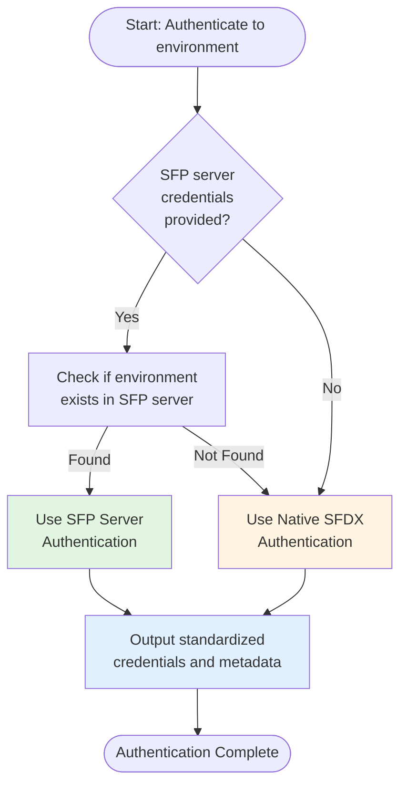

# Using Hybrid Authentication in Custom Workflows

The `authToEnvironmentHybrid` action provides a flexible authentication mechanism for custom workflows. It automatically detects whether an environment is registered with SFP server and uses the appropriate authentication method, making it ideal for custom workflows that need to work across both managed and unmanaged environments.

## Overview

When building custom workflows in sfops, you often need to authenticate to various Salesforce environments. The hybrid authentication action simplifies this by:

- **Automatically detecting** if environments are registered in SFP server
- **Seamlessly switching** between SFP server authentication and native SFDX authentication
- **Providing consistent outputs** regardless of the authentication method used
- **Eliminating configuration overhead** for developers creating custom workflows

This makes it perfect for:
- Custom deployment workflows
- Ad-hoc data operations
- Custom validation workflows
- Environment-specific automation
- Any workflow that needs to work across different environment setups

## How It Works

The action follows an intelligent decision flow:



## Prerequisites

Before using this action in your custom workflow, ensure:

1. **Your workflow uses the sfops Docker image** - Required for SFP CLI and other dependencies:
   ```yaml
   jobs:
     your-job:
       runs-on: ubuntu-latest
       container: ${{ sfops.sfops_docker_image }}
   ```

2. **Secrets are configured** based on your authentication needs:
   - For SFP server auth: `SFP_SERVER_URL` (variable) and `SFP_SERVER_TOKEN` (secret)
   - For native auth: `DEVHUB_SFDX_AUTH_URL` and optionally environment-specific auth URLs

## Referencing the Action

The `authToEnvironmentHybrid` action is located in your sfops repository. In all examples below, the action is referenced using:

```yaml
uses: ${{ sfops.repo_owner }}/${{ sfops.action_repository }}/authToEnvironmentHybrid@main
```

The `${{ sfops.repo_owner }}/${{ sfops.action_repository }}` template variables are automatically replaced with your organization and sfops repository name (e.g., `flxbl-io/sfops-gh-actions`). This ensures the workflow references your specific sfops deployment.

## Basic Usage

### Simple Authentication

The minimal configuration requires only the environment name and repository:

```yaml
name: Custom Workflow with Hybrid Auth
on:
  workflow_dispatch:
    inputs:
      environment:
        description: 'Target environment'
        required: true
        type: string

jobs:
  deploy-custom-logic:
    runs-on: ubuntu-latest
    container: ${{ sfops.sfops_docker_image }}
    steps:
      - name: Checkout
        uses: actions/checkout@v4

      - name: Authenticate to Environment
        id: auth
        uses: ${{ sfops.repo_owner }}/${{ sfops.action_repository }}/authToEnvironmentHybrid@main
        with:
          environment: ${{ inputs.environment }}
          repository: ${{ github.repository }}
          # Optional: SFP server credentials
          sfp-server-url: ${{ vars.SFP_SERVER_URL }}
          sfp-server-token: ${{ secrets.SFP_SERVER_TOKEN }}
          # Optional: Fallback auth URLs
          DEVHUB_SFDX_AUTH_URL: ${{ secrets.DEVHUB_SFDX_AUTH_URL }}
          ENV_SFDX_AUTH_URL: ${{ secrets[format('{0}_SFDX_AUTH_URL', inputs.environment)] }}

      - name: Display Authentication Info
        run: |
          echo "Authenticated using: ${{ steps.auth.outputs.auth_method }}"
          echo "Org alias: ${{ steps.auth.outputs.alias }}"
          echo "Username: ${{ steps.auth.outputs.username }}"
          echo "Instance URL: ${{ steps.auth.outputs.instance_url }}"
```

### Full-Featured Implementation

For production workflows, include all authentication options and error handling:

```yaml
name: Custom Data Migration Workflow
on:
  workflow_dispatch:
    inputs:
      environment:
        description: 'Target environment'
        required: true
        type: choice
        options:
          - STAGING
          - UAT
          - PREPROD
          - production

jobs:
  data-migration:
    runs-on: ubuntu-latest
    container: ${{ sfops.sfops_docker_image }}
    environment: ${{ inputs.environment }}

    steps:
      - name: Checkout Repository
        uses: actions/checkout@v4

      - name: Authenticate to Target Environment
        id: auth
        uses: ${{ sfops.repo_owner }}/${{ sfops.action_repository }}/authToEnvironmentHybrid@main
        with:
          environment: ${{ inputs.environment }}
          repository: ${{ github.repository }}
          environment-profile: ${{ inputs.environment }}
          # SFP Server Authentication (preferred)
          sfp-server-url: ${{ vars.SFP_SERVER_URL }}
          sfp-server-token: ${{ secrets.SFP_SERVER_TOKEN }}
          # Native Authentication Fallbacks
          DEVHUB_SFDX_AUTH_URL: ${{ secrets.DEVHUB_SFDX_AUTH_URL }}
          ENV_SFDX_AUTH_URL: ${{ secrets[format('{0}_SFDX_AUTH_URL', inputs.environment)] }}
          SB_SFDX_AUTH_URL: ${{ secrets[format('SB_{0}_SFDX_AUTH_URL', inputs.environment)] }}

      - name: Verify Authentication
        run: |
          echo "✅ Authentication Method: ${{ steps.auth.outputs.auth_method }}"
          echo "✅ Org Alias: ${{ steps.auth.outputs.alias }}"
          echo "✅ Username: ${{ steps.auth.outputs.username }}"
          echo "✅ Org ID: ${{ steps.auth.outputs.org_id }}"
          echo "✅ Instance URL: ${{ steps.auth.outputs.instance_url }}"

          if [ "${{ steps.auth.outputs.is_active }}" == "false" ]; then
            echo "⚠️ Warning: Environment is marked as inactive in SFP server"
          fi

      - name: Execute Custom Logic
        run: |
          # Your custom logic here using the authenticated org
          # The org is available using the alias: ${{ steps.auth.outputs.alias }}
          sf data query --query "SELECT Id, Name FROM Account LIMIT 10" \
            --target-org ${{ steps.auth.outputs.alias }}

      - name: Post Deployment Verification
        if: success()
        run: |
          echo "Deployment completed successfully to ${{ steps.auth.outputs.username }}"
```

## Input Reference

### Required Inputs

| Input | Description | Example |
|-------|-------------|---------|
| `environment` | Name of the target environment | `staging`, `uat`, `production` |
| `repository` | Repository in format owner/repo | `${{ github.repository }}` |

### Optional Inputs - SFP Server Authentication

| Input | Description | When to Use |
|-------|-------------|-------------|
| `sfp-server-url` | URL to SFP server instance | When using SFP server for centralized authentication management |
| `sfp-server-token` | Authentication token for SFP server | Required if `sfp-server-url` is provided |

### Optional Inputs - Native Authentication

| Input | Description | When to Use |
|-------|-------------|-------------|
| `DEVHUB_SFDX_AUTH_URL` | Auth URL to DevHub org | Always recommended as fallback |
| `ENV_SFDX_AUTH_URL` | Auth URL to specific environment | For direct environment authentication |
| `SB_SFDX_AUTH_URL` | Auth URL to sandbox | For sandbox-specific authentication |
| `environment-profile` | Environment profile/alias to use | For custom alias naming |
| `org-name` | Sandbox name if different from environment | When sandbox name differs from environment name |

## Output Reference

The action provides comprehensive outputs that can be used in subsequent steps:

### Authentication Metadata

| Output | Description | Example Value |
|--------|-------------|---------------|
| `auth_method` | Authentication method used | `sfp-server` or `native` |
| `alias` | Org alias for SF CLI commands | `staging`, `uat` |
| `is_active` | Whether environment is active (SFP server only) | `true` or `false` |

### Org Information

| Output | Description | Usage |
|--------|-------------|-------|
| `username` | Authenticated user's username | Logging, verification |
| `org_id` | Salesforce org ID | Org identification |
| `instance_url` | Salesforce instance URL | API calls, links |
| `login_url` | Login URL for the org | Authentication verification |
| `access_token` | OAuth access token | Direct API calls (use carefully) |
| `api_version` | Salesforce API version | API compatibility checks |
| `devhub_username` | DevHub username (native auth only) | DevHub operations |

## Common Use Cases

### 1. Custom Deployment Workflow

Deploy specific components to any environment with automatic authentication:

```yaml
name: Deploy Custom Components
on:
  workflow_dispatch:
    inputs:
      environment:
        required: true
        type: string
      component_path:
        required: true
        type: string

jobs:
  deploy:
    runs-on: ubuntu-latest
    steps:
      - uses: actions/checkout@v4

      - name: Authenticate
        id: auth
        uses: ${{ sfops.repo_owner }}/${{ sfops.action_repository }}/authToEnvironmentHybrid@main
        with:
          environment: ${{ inputs.environment }}
          repository: ${{ github.repository }}
          sfp-server-url: ${{ vars.SFP_SERVER_URL }}
          sfp-server-token: ${{ secrets.SFP_SERVER_TOKEN }}
          DEVHUB_SFDX_AUTH_URL: ${{ secrets.DEVHUB_SFDX_AUTH_URL }}

      - name: Deploy Components
        run: |
          sf project deploy start \
            --source-dir ${{ inputs.component_path }} \
            --target-org ${{ steps.auth.outputs.alias }} \
            --wait 30
```

### 2. Data Export/Import Workflow

Export data from one environment and import to another:

```yaml
name: Data Migration
on:
  workflow_dispatch:
    inputs:
      source_env:
        required: true
      target_env:
        required: true

jobs:
  migrate-data:
    runs-on: ubuntu-latest
    steps:
      - uses: actions/checkout@v4

      - name: Auth to Source
        id: auth-source
        uses: ${{ sfops.repo_owner }}/${{ sfops.action_repository }}/authToEnvironmentHybrid@main
        with:
          environment: ${{ inputs.source_env }}
          repository: ${{ github.repository }}
          sfp-server-url: ${{ vars.SFP_SERVER_URL }}
          sfp-server-token: ${{ secrets.SFP_SERVER_TOKEN }}
          DEVHUB_SFDX_AUTH_URL: ${{ secrets.DEVHUB_SFDX_AUTH_URL }}

      - name: Auth to Target
        id: auth-target
        uses: ${{ sfops.repo_owner }}/${{ sfops.action_repository }}/authToEnvironmentHybrid@main
        with:
          environment: ${{ inputs.target_env }}
          repository: ${{ github.repository }}
          sfp-server-url: ${{ vars.SFP_SERVER_URL }}
          sfp-server-token: ${{ secrets.SFP_SERVER_TOKEN }}
          DEVHUB_SFDX_AUTH_URL: ${{ secrets.DEVHUB_SFDX_AUTH_URL }}

      - name: Export from Source
        run: |
          sf data export tree \
            --query data/export-query.soql \
            --output-dir ./data \
            --target-org ${{ steps.auth-source.outputs.alias }}

      - name: Import to Target
        run: |
          sf data import tree \
            --plan ./data/plan.json \
            --target-org ${{ steps.auth-target.outputs.alias }}
```

### 3. Multi-Environment Validation

Run validations across multiple environments in parallel:

```yaml
name: Multi-Environment Validation
on:
  pull_request:
  workflow_dispatch:

jobs:
  validate:
    runs-on: ubuntu-latest
    strategy:
      matrix:
        environment: [staging, uat, preprod]

    steps:
      - uses: actions/checkout@v4

      - name: Authenticate to ${{ matrix.environment }}
        id: auth
        uses: ${{ sfops.repo_owner }}/${{ sfops.action_repository }}/authToEnvironmentHybrid@main
        with:
          environment: ${{ matrix.environment }}
          repository: ${{ github.repository }}
          sfp-server-url: ${{ vars.SFP_SERVER_URL }}
          sfp-server-token: ${{ secrets.SFP_SERVER_TOKEN }}
          DEVHUB_SFDX_AUTH_URL: ${{ secrets.DEVHUB_SFDX_AUTH_URL }}

      - name: Run Validation
        run: |
          sf project deploy validate \
            --source-dir force-app \
            --target-org ${{ steps.auth.outputs.alias }} \
            --test-level RunLocalTests
```

### 4. Scheduled Maintenance Tasks

Automate routine maintenance across environments:

```yaml
name: Nightly Maintenance
on:
  schedule:
    - cron: '0 2 * * *'  # 2 AM daily
  workflow_dispatch:
    inputs:
      environment:
        type: string
        default: 'staging'

jobs:
  maintenance:
    runs-on: ubuntu-latest
    steps:
      - uses: actions/checkout@v4

      - name: Authenticate
        id: auth
        uses: ${{ sfops.repo_owner }}/${{ sfops.action_repository }}/authToEnvironmentHybrid@main
        with:
          environment: ${{ inputs.environment || 'staging' }}
          repository: ${{ github.repository }}
          sfp-server-url: ${{ vars.SFP_SERVER_URL }}
          sfp-server-token: ${{ secrets.SFP_SERVER_TOKEN }}
          DEVHUB_SFDX_AUTH_URL: ${{ secrets.DEVHUB_SFDX_AUTH_URL }}

      - name: Execute Maintenance Script
        run: |
          sf apex run \
            --file scripts/maintenance.apex \
            --target-org ${{ steps.auth.outputs.alias }}
```

## Authentication Strategies

### Strategy 1: SFP Server First (Recommended)

This is the recommended approach for teams using SFP Pro with SFP server:

```yaml
with:
  environment: ${{ inputs.environment }}
  repository: ${{ github.repository }}
  # SFP server takes precedence
  sfp-server-url: ${{ vars.SFP_SERVER_URL }}
  sfp-server-token: ${{ secrets.SFP_SERVER_TOKEN }}
  # Fallbacks for unregistered environments
  DEVHUB_SFDX_AUTH_URL: ${{ secrets.DEVHUB_SFDX_AUTH_URL }}
```

**When to use:**
- Your team has SFP server configured
- Most environments are registered in SFP server
- You want centralized credential management
- You need audit trails and access control

### Strategy 2: Native Only

Use this for simpler setups or when not using SFP server:

```yaml
with:
  environment: ${{ inputs.environment }}
  repository: ${{ github.repository }}
  DEVHUB_SFDX_AUTH_URL: ${{ secrets.DEVHUB_SFDX_AUTH_URL }}
  ENV_SFDX_AUTH_URL: ${{ secrets[format('{0}_SFDX_AUTH_URL', inputs.environment)] }}
```

**When to use:**
- Not using SFP server
- Simple environment setup
- All credentials managed in GitHub secrets
- Smaller teams or projects

### Strategy 3: Dynamic Secret Loading

Load environment-specific secrets dynamically using GitHub's secret name formatting:

```yaml
jobs:
  deploy:
    runs-on: ubuntu-latest
    container: ${{ sfops.sfops_docker_image }}
    strategy:
      matrix:
        environment: [STAGING, UAT, PREPROD]

    steps:
      - name: Authenticate
        uses: ${{ sfops.repo_owner }}/${{ sfops.action_repository }}/authToEnvironmentHybrid@main
        with:
          environment: ${{ matrix.environment }}
          repository: ${{ github.repository }}
          DEVHUB_SFDX_AUTH_URL: ${{ secrets.DEVHUB_SFDX_AUTH_URL }}
          # Dynamically loads {ENVIRONMENT_NAME}_SFDX_AUTH_URL secret
          ENV_SFDX_AUTH_URL: ${{ secrets[format('{0}_SFDX_AUTH_URL', matrix.environment)] }}
```

**Important:** When using dynamic secret loading with native authentication, you are limited to specific environment names because GitHub Actions requires secrets to be explicitly defined in your workflow. The standard supported environments are:

- `STAGING` → `STAGING_SFDX_AUTH_URL`
- `PREPROD` → `PREPROD_SFDX_AUTH_URL`
- `UAT` → `UAT_SFDX_AUTH_URL`
- `QA` → `QA_SFDX_AUTH_URL`
- `IQA` → `IQA_SFDX_AUTH_URL`
- `SIT` → `SIT_SFDX_AUTH_URL`

**With SFP Server**, this limitation does not apply - you can use any environment name as credentials are managed centrally in the server.
