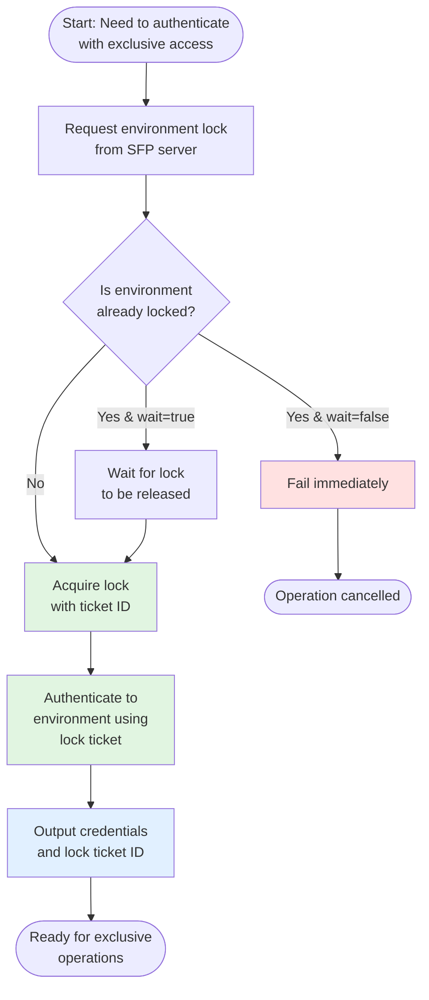

# Using Authentication with Environment Locking

The `authToEnvironmentWithLock` action provides secure authentication with exclusive environment locking through SFP server. This ensures only one workflow can access an environment at a time, making it ideal for critical operations that require exclusive access such as deployments, data migrations, or destructive operations.

## Overview

When performing critical operations on Salesforce environments, you often need to ensure exclusive access to prevent conflicts. The authentication with lock action provides:

- **Exclusive environment access** through SFP server's locking mechanism
- **Automatic wait functionality** when environments are already locked
- **Lock tracking** with ticket IDs for proper cleanup
- **Prevention of concurrent operations** that could cause conflicts
- **Configurable lock duration** based on operation requirements

This makes it perfect for:
- Production deployments
- Data migration operations
- Destructive changes (metadata deletion)
- Schema modifications
- Any operation requiring guaranteed exclusive access

## How It Works

The action follows this workflow:



## Prerequisites

Before using this action in your custom workflow, ensure:

1. **Your workflow uses the sfops Docker image** - Required for SFP CLI and dependencies:
   ```yaml
   jobs:
     your-job:
       runs-on: ubuntu-latest
       container: ${{ sfops.sfops_docker_image }}
   ```

2. **SFP server credentials are configured**:
   - `SFP_SERVER_URL` as a variable
   - `SFP_SERVER_TOKEN` as a secret

3. **Environment is registered in SFP server** - This action only works with environments managed by SFP server

## Referencing the Action

The `authToEnvironmentWithLock` action is located in your sfops repository. In all examples below, the action is referenced using:

```yaml
uses: ${{ sfops.repo_owner }}/${{ sfops.action_repository }}/authToEnvironmentWithLock@main
```

The `${{ sfops.repo_owner }}/${{ sfops.action_repository }}` template variables are automatically replaced with your organization and sfops repository name (e.g., `flxbl-io/sfops-gh-actions`).

## Basic Usage

### Simple Authentication with Lock

The minimal configuration for exclusive environment access:

```yaml
name: Deploy with Exclusive Access
on:
  workflow_dispatch:
    inputs:
      environment:
        description: 'Target environment'
        required: true
        type: string

jobs:
  deploy-with-lock:
    runs-on: ubuntu-latest
    container: ${{ sfops.sfops_docker_image }}
    steps:
      - name: Checkout
        uses: actions/checkout@v4

      - name: Lock and Authenticate
        id: auth
        uses: ${{ sfops.repo_owner }}/${{ sfops.action_repository }}/authToEnvironmentWithLock@main
        with:
          environment: ${{ inputs.environment }}
          repository: ${{ github.repository }}
          reason: "Deployment from workflow"
          sfp-server-url: ${{ vars.SFP_SERVER_URL }}
          sfp-server-token: ${{ secrets.SFP_SERVER_TOKEN }}

      - name: Deploy Components
        run: |
          # Your deployment commands here
          sfp deploy --target-org ${{ steps.auth.outputs.alias }}

      - name: Unlock Environment
        if: always()
        run: |
          sfp server environment unlock \
            --name ${{ inputs.environment }} \
            --repository ${{ github.repository }} \
            --lock-ticket-id ${{ steps.auth.outputs.ticket_id }}
```

### With Custom Lock Duration

Configure how long to hold the lock:

```yaml
- name: Lock for Extended Operation
  id: auth
  uses: ${{ sfops.repo_owner }}/${{ sfops.action_repository }}/authToEnvironmentWithLock@main
  with:
    environment: production
    repository: ${{ github.repository }}
    duration: 120  # Lock for 2 hours
    reason: "Large data migration operation"
    sfp-server-url: ${{ vars.SFP_SERVER_URL }}
    sfp-server-token: ${{ secrets.SFP_SERVER_TOKEN }}
```

### Fail Fast Without Waiting

Configure the action to fail immediately if the environment is locked:

```yaml
- name: Try to Lock (No Wait)
  id: auth
  uses: ${{ sfops.repo_owner }}/${{ sfops.action_repository }}/authToEnvironmentWithLock@main
  with:
    environment: ${{ inputs.environment }}
    repository: ${{ github.repository }}
    reason: "Quick validation check"
    wait: false  # Fail immediately if locked
    sfp-server-url: ${{ vars.SFP_SERVER_URL }}
    sfp-server-token: ${{ secrets.SFP_SERVER_TOKEN }}
```

## Advanced Usage

### Data Migration with Lock

A complete example for data migration with proper locking:

```yaml
name: Data Migration with Lock
on:
  workflow_dispatch:
    inputs:
      source_env:
        description: 'Source environment'
        required: true
      target_env:
        description: 'Target environment'
        required: true

jobs:
  migrate-data:
    runs-on: ubuntu-latest
    container: ${{ sfops.sfops_docker_image }}
    steps:
      - name: Checkout
        uses: actions/checkout@v4

      - name: Lock Source Environment
        id: source-auth
        uses: ${{ sfops.repo_owner }}/${{ sfops.action_repository }}/authToEnvironmentWithLock@main
        with:
          environment: ${{ inputs.source_env }}
          repository: ${{ github.repository }}
          duration: 60
          reason: "Data export for migration"
          sfp-server-url: ${{ vars.SFP_SERVER_URL }}
          sfp-server-token: ${{ secrets.SFP_SERVER_TOKEN }}

      - name: Lock Target Environment
        id: target-auth
        uses: ${{ sfops.repo_owner }}/${{ sfops.action_repository }}/authToEnvironmentWithLock@main
        with:
          environment: ${{ inputs.target_env }}
          repository: ${{ github.repository }}
          duration: 60
          reason: "Data import from ${{ inputs.source_env }}"
          sfp-server-url: ${{ vars.SFP_SERVER_URL }}
          sfp-server-token: ${{ secrets.SFP_SERVER_TOKEN }}

      - name: Export Data
        run: |
          # Export data from source
          sfdx data:export:tree \
            --targetusername ${{ steps.source-auth.outputs.alias }} \
            --outputdir ./data-export \
            --query "SELECT Id, Name FROM Account"

      - name: Import Data
        run: |
          # Import data to target
          sfdx data:import:tree \
            --targetusername ${{ steps.target-auth.outputs.alias }} \
            --plan ./data-export/plan.json

      - name: Unlock Environments
        if: always()
        run: |
          # Unlock source
          sfp server environment unlock \
            --name ${{ inputs.source_env }} \
            --repository ${{ github.repository }} \
            --lock-ticket-id ${{ steps.source-auth.outputs.ticket_id }} || true

          # Unlock target
          sfp server environment unlock \
            --name ${{ inputs.target_env }} \
            --repository ${{ github.repository }} \
            --lock-ticket-id ${{ steps.target-auth.outputs.ticket_id }} || true
```

### Deployment with Validation

Example with pre-deployment validation:

```yaml
name: Deploy with Validation
on:
  workflow_dispatch:
    inputs:
      environment:
        description: 'Target environment'
        required: true
        type: choice
        options:
          - staging
          - production

jobs:
  deploy:
    runs-on: ubuntu-latest
    container: ${{ sfops.sfops_docker_image }}
    steps:
      - name: Checkout
        uses: actions/checkout@v4

      - name: Lock and Authenticate
        id: auth
        uses: ${{ sfops.repo_owner }}/${{ sfops.action_repository }}/authToEnvironmentWithLock@main
        with:
          environment: ${{ inputs.environment }}
          repository: ${{ github.repository }}
          duration: 90
          reason: "Deployment with validation"
          sfp-server-url: ${{ vars.SFP_SERVER_URL }}
          sfp-server-token: ${{ secrets.SFP_SERVER_TOKEN }}

      - name: Check Environment Status
        run: |
          if [[ "${{ steps.auth.outputs.is_active }}" != "true" ]]; then
            echo "Environment is not active. Aborting deployment."
            exit 1
          fi

      - name: Run Validation
        run: |
          sfp validate \
            --target-org ${{ steps.auth.outputs.alias }} \
            --mode thorough

      - name: Deploy
        run: |
          sfp deploy \
            --target-org ${{ steps.auth.outputs.alias }} \
            --wait-time 120

      - name: Run Tests
        run: |
          sfdx force:apex:test:run \
            --targetusername ${{ steps.auth.outputs.alias }} \
            --resultformat json \
            --testlevel RunLocalTests \
            --wait 30

      - name: Unlock Environment
        if: always()
        run: |
          sfp server environment unlock \
            --name ${{ inputs.environment }} \
            --repository ${{ github.repository }} \
            --lock-ticket-id ${{ steps.auth.outputs.ticket_id }}
```

## Input Reference

| Input | Required | Default | Description |
|-------|----------|---------|-------------|
| `environment` | Yes | - | Name of the environment to lock and authenticate |
| `repository` | Yes | - | Repository name in `owner/repo` format |
| `reason` | Yes | - | Reason for locking the environment (logged for audit) |
| `sfp-server-url` | Yes | - | URL to your SFP server instance |
| `sfp-server-token` | Yes | - | Authentication token for SFP server |
| `duration` | No | `60` | Lock duration in minutes |
| `wait` | No | `true` | Whether to wait if environment is already locked |

## Output Reference

| Output | Description | Example Usage |
|--------|-------------|---------------|
| `alias` | Alias of the authenticated org | `${{ steps.auth.outputs.alias }}` |
| `ticket_id` | Lock ticket ID for unlocking | `${{ steps.auth.outputs.ticket_id }}` |
| `is_active` | Whether the environment is active | `${{ steps.auth.outputs.is_active }}` |
| `org_id` | Salesforce Org ID | `${{ steps.auth.outputs.org_id }}` |
| `instance_url` | Instance URL | `${{ steps.auth.outputs.instance_url }}` |
| `login_url` | Login URL | `${{ steps.auth.outputs.login_url }}` |
| `access_token` | Access token for API calls | `${{ steps.auth.outputs.access_token }}` |
| `username` | Username of authenticated user | `${{ steps.auth.outputs.username }}` |

## Common Use Cases

### Production Deployments
Use locks to ensure only one deployment happens at a time in production environments.

### Data Operations
Prevent concurrent data modifications that could cause inconsistencies.

### Schema Changes
Ensure exclusive access when modifying object structures or relationships.

### Destructive Changes
Protect against conflicts when removing metadata components.

### Maintenance Windows
Lock environments during scheduled maintenance operations.

## Troubleshooting

### Lock Not Released
If a workflow fails without releasing a lock:
1. Check the SFP server UI for active locks
2. Use the lock ticket ID from workflow logs
3. Manually unlock using: `sfp server environment unlock --lock-ticket-id <ticket>`

### Authentication Failures
Ensure:
- Environment is registered in SFP server
- SFP server credentials are correct
- Environment has valid authentication configured

### Lock Wait Timeout
If waiting for a lock times out:
- Check who holds the current lock in SFP server
- Coordinate with the team member
- Consider increasing the wait timeout or retry later

## See Also

- [Authentication Without Lock](auth-to-environment-without-lock.md) - For read-only operations
- [Hybrid Authentication](auth-to-environment-hybrid.md) - For flexible authentication scenarios
- [SFP Server Documentation](https://docs.sfops.io) - Complete SFP server reference