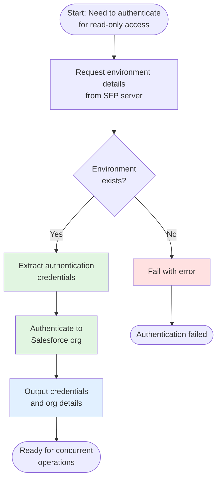

# Using Authentication Without Environment Locking

The `authToEnvironmentWithoutLock` action provides streamlined authentication to Salesforce environments through SFP server without acquiring an exclusive lock. This enables multiple workflows to access the same environment simultaneously, making it ideal for read-only operations, monitoring, and scenarios where concurrent access is safe.

## Overview

When performing read-only operations or non-conflicting tasks on Salesforce environments, exclusive locking is often unnecessary and can create bottlenecks. The authentication without lock action provides:

- **Concurrent environment access** allowing multiple workflows to run simultaneously
- **Faster authentication** by skipping the lock acquisition process
- **Read-only safety** for operations that don't modify the environment
- **Reduced wait times** in busy CI/CD pipelines
- **Simplified workflow logic** when locks aren't needed

This makes it perfect for:
- Data queries and exports
- Environment health checks
- Monitoring and reporting
- Test execution (read-only)
- Metadata inspection
- Any non-modifying operations

## How It Works

The action follows this streamlined workflow:



## Prerequisites

Before using this action in your custom workflow, ensure:

1. **Your workflow uses the sfops Docker image** - Required for SFP CLI and dependencies:
   ```yaml
   jobs:
     your-job:
       runs-on: ubuntu-latest
       container: ${{ sfops.sfops_docker_image }}
   ```

2. **SFP server credentials are configured**:
   - `SFP_SERVER_URL` as a variable
   - `SFP_SERVER_TOKEN` as a secret

3. **Environment is registered in SFP server** - This action only works with environments managed by SFP server

## Referencing the Action

The `authToEnvironmentWithoutLock` action is located in your sfops repository. In all examples below, the action is referenced using:

```yaml
uses: ${{ sfops.repo_owner }}/${{ sfops.action_repository }}/authToEnvironmentWithoutLock@main
```

The `${{ sfops.repo_owner }}/${{ sfops.action_repository }}` template variables are automatically replaced with your organization and sfops repository name (e.g., `flxbl-io/sfops-gh-actions`).

## Basic Usage

### Simple Authentication for Read Operations

The minimal configuration for authentication without locking:

```yaml
name: Query Environment Data
on:
  workflow_dispatch:
    inputs:
      environment:
        description: 'Target environment'
        required: true
        type: string

jobs:
  query-data:
    runs-on: ubuntu-latest
    container: ${{ sfops.sfops_docker_image }}
    steps:
      - name: Checkout
        uses: actions/checkout@v4

      - name: Authenticate Without Lock
        id: auth
        uses: ${{ sfops.repo_owner }}/${{ sfops.action_repository }}/authToEnvironmentWithoutLock@main
        with:
          environment: ${{ inputs.environment }}
          repository: ${{ github.repository }}
          sfp-server-url: ${{ vars.SFP_SERVER_URL }}
          sfp-server-token: ${{ secrets.SFP_SERVER_TOKEN }}

      - name: Query Data
        run: |
          # Safe to run concurrently - read-only operation
          sfdx force:data:soql:query \
            --targetusername ${{ steps.auth.outputs.alias }} \
            --query "SELECT COUNT() FROM Account" \
            --json
```

### Parallel Environment Checks

Run concurrent checks across multiple environments:

```yaml
name: Multi-Environment Health Check
on:
  schedule:
    - cron: '0 */6 * * *'  # Every 6 hours

jobs:
  check-environment:
    runs-on: ubuntu-latest
    container: ${{ sfops.sfops_docker_image }}
    strategy:
      matrix:
        environment: [dev, staging, uat, production]
    steps:
      - name: Checkout
        uses: actions/checkout@v4

      - name: Authenticate Without Lock
        id: auth
        uses: ${{ sfops.repo_owner }}/${{ sfops.action_repository }}/authToEnvironmentWithoutLock@main
        with:
          environment: ${{ matrix.environment }}
          repository: ${{ github.repository }}
          sfp-server-url: ${{ vars.SFP_SERVER_URL }}
          sfp-server-token: ${{ secrets.SFP_SERVER_TOKEN }}

      - name: Check Environment Health
        run: |
          # Multiple jobs can check different environments simultaneously
          sfdx force:limits:api:display \
            --targetusername ${{ steps.auth.outputs.alias }} \
            --json

      - name: Check Apex Test Coverage
        run: |
          sfdx force:apex:test:report \
            --targetusername ${{ steps.auth.outputs.alias }} \
            --codecoverage \
            --json
```

## Advanced Usage

### Data Export Pipeline

Export data from multiple environments concurrently:

```yaml
name: Concurrent Data Export
on:
  workflow_dispatch:
    inputs:
      query:
        description: 'SOQL Query'
        required: true
        default: 'SELECT Id, Name FROM Account LIMIT 100'

jobs:
  export-data:
    runs-on: ubuntu-latest
    container: ${{ sfops.sfops_docker_image }}
    strategy:
      matrix:
        environment: [sandbox1, sandbox2, sandbox3]
    steps:
      - name: Checkout
        uses: actions/checkout@v4

      - name: Authenticate Without Lock
        id: auth
        uses: ${{ sfops.repo_owner }}/${{ sfops.action_repository }}/authToEnvironmentWithoutLock@main
        with:
          environment: ${{ matrix.environment }}
          repository: ${{ github.repository }}
          sfp-server-url: ${{ vars.SFP_SERVER_URL }}
          sfp-server-token: ${{ secrets.SFP_SERVER_TOKEN }}

      - name: Export Data
        run: |
          # Safe concurrent read operations
          mkdir -p exports/${{ matrix.environment }}

          sfdx force:data:tree:export \
            --targetusername ${{ steps.auth.outputs.alias }} \
            --query "${{ inputs.query }}" \
            --outputdir exports/${{ matrix.environment }} \
            --json

      - name: Upload Export
        uses: actions/upload-artifact@v3
        with:
          name: data-export-${{ matrix.environment }}
          path: exports/${{ matrix.environment }}
```

### Monitoring and Alerting

Create a monitoring workflow that runs frequently:

```yaml
name: Environment Monitoring
on:
  schedule:
    - cron: '*/30 * * * *'  # Every 30 minutes

jobs:
  monitor:
    runs-on: ubuntu-latest
    container: ${{ sfops.sfops_docker_image }}
    steps:
      - name: Checkout
        uses: actions/checkout@v4

      - name: Authenticate to Production
        id: auth
        uses: ${{ sfops.repo_owner }}/${{ sfops.action_repository }}/authToEnvironmentWithoutLock@main
        with:
          environment: production
          repository: ${{ github.repository }}
          sfp-server-url: ${{ vars.SFP_SERVER_URL }}
          sfp-server-token: ${{ secrets.SFP_SERVER_TOKEN }}

      - name: Check Environment Status
        id: check
        run: |
          # Check if environment is active
          if [[ "${{ steps.auth.outputs.is_active }}" != "true" ]]; then
            echo "alert=true" >> $GITHUB_OUTPUT
            echo "message=Production environment is inactive!" >> $GITHUB_OUTPUT
          fi

          # Check API limits
          limits=$(sfdx force:limits:api:display \
            --targetusername ${{ steps.auth.outputs.alias }} \
            --json)

          daily_api_used=$(echo $limits | jq '.result[0].remaining')
          if [[ $daily_api_used -lt 1000 ]]; then
            echo "alert=true" >> $GITHUB_OUTPUT
            echo "message=Low API limits: $daily_api_used remaining" >> $GITHUB_OUTPUT
          fi

      - name: Send Alert
        if: steps.check.outputs.alert == 'true'
        run: |
          # Send alert via your notification system
          echo "ALERT: ${{ steps.check.outputs.message }}"
```

### Metadata Comparison

Compare metadata across environments without locking:

```yaml
name: Compare Environment Metadata
on:
  workflow_dispatch:
    inputs:
      source_env:
        description: 'Source environment'
        required: true
      target_env:
        description: 'Target environment'
        required: true

jobs:
  compare:
    runs-on: ubuntu-latest
    container: ${{ sfops.sfops_docker_image }}
    steps:
      - name: Checkout
        uses: actions/checkout@v4

      - name: Authenticate to Source
        id: source-auth
        uses: ${{ sfops.repo_owner }}/${{ sfops.action_repository }}/authToEnvironmentWithoutLock@main
        with:
          environment: ${{ inputs.source_env }}
          repository: ${{ github.repository }}
          sfp-server-url: ${{ vars.SFP_SERVER_URL }}
          sfp-server-token: ${{ secrets.SFP_SERVER_TOKEN }}

      - name: Authenticate to Target
        id: target-auth
        uses: ${{ sfops.repo_owner }}/${{ sfops.action_repository }}/authToEnvironmentWithoutLock@main
        with:
          environment: ${{ inputs.target_env }}
          repository: ${{ github.repository }}
          sfp-server-url: ${{ vars.SFP_SERVER_URL }}
          sfp-server-token: ${{ secrets.SFP_SERVER_TOKEN }}

      - name: Retrieve Source Metadata
        run: |
          sfdx force:source:retrieve \
            --targetusername ${{ steps.source-auth.outputs.alias }} \
            --manifest package.xml \
            --retrievetargetdir source-metadata

      - name: Retrieve Target Metadata
        run: |
          sfdx force:source:retrieve \
            --targetusername ${{ steps.target-auth.outputs.alias }} \
            --manifest package.xml \
            --retrievetargetdir target-metadata

      - name: Compare Metadata
        run: |
          # Generate diff report
          diff -r source-metadata target-metadata > metadata-diff.txt || true

          if [ -s metadata-diff.txt ]; then
            echo "Differences found between environments"
            cat metadata-diff.txt
          else
            echo "Environments are in sync"
          fi
```

## Input Reference

| Input | Required | Default | Description |
|-------|----------|---------|-------------|
| `environment` | Yes | - | Name of the environment to authenticate to |
| `repository` | Yes | - | Repository name in `owner/repo` format |
| `sfp-server-url` | Yes | - | URL to your SFP server instance |
| `sfp-server-token` | Yes | - | Authentication token for SFP server |

## Output Reference

| Output | Description | Example Usage |
|--------|-------------|---------------|
| `alias` | Alias of the authenticated org | `${{ steps.auth.outputs.alias }}` |
| `is_active` | Whether the environment is active | `${{ steps.auth.outputs.is_active }}` |
| `org_id` | Salesforce Org ID | `${{ steps.auth.outputs.org_id }}` |
| `instance_url` | Instance URL | `${{ steps.auth.outputs.instance_url }}` |
| `login_url` | Login URL | `${{ steps.auth.outputs.login_url }}` |
| `access_token` | Access token for API calls | `${{ steps.auth.outputs.access_token }}` |
| `username` | Username of authenticated user | `${{ steps.auth.outputs.username }}` |

## Common Use Cases

### Reporting and Analytics
Generate reports from multiple environments simultaneously without blocking deployments.

### Environment Monitoring
Continuously monitor environment health, limits, and performance metrics.

### Data Validation
Verify data consistency across environments without preventing other operations.

### Test Execution
Run read-only test suites that don't modify data or metadata.

### Backup Operations
Export data and metadata for backup purposes while other workflows continue.

## When to Use Lock vs Without Lock

| Use With Lock | Use Without Lock |
|--------------|------------------|
| Deployments | Data queries |
| Data imports | Data exports |
| Destructive changes | Metadata retrieval |
| Schema modifications | Environment monitoring |
| Configuration changes | Report generation |
| Any write operations | Read-only validation |

## Troubleshooting

### Authentication Failures
Ensure:
- Environment is registered in SFP server
- SFP server credentials are correct
- Network connectivity to SFP server

### Environment Not Found
Verify:
- Environment name is correct
- Environment is registered for your repository
- SFP server is accessible

### Concurrent Access Issues
If experiencing issues with concurrent access:
- Verify operations are truly read-only
- Consider if a lock might be needed for safety
- Check for any environment-specific limitations

## See Also

- [Authentication With Lock](auth-to-environment-with-lock.md) - For exclusive access operations
- [Hybrid Authentication](auth-to-environment-hybrid.md) - For flexible authentication scenarios
- [SFP Server Documentation](https://docs.sfops.io) - Complete SFP server reference